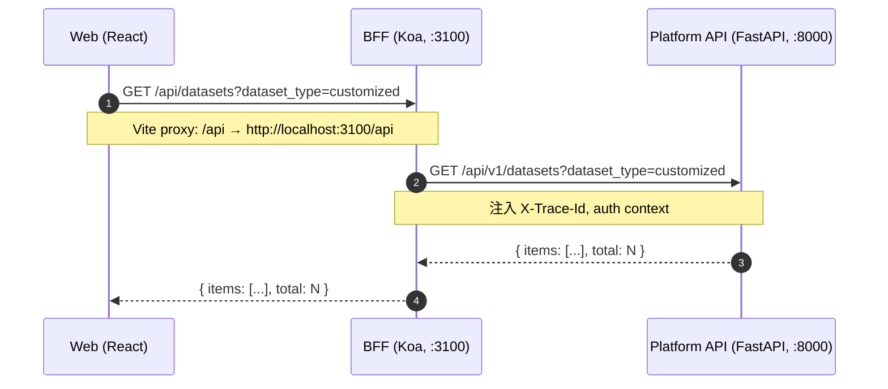

# 内部 API：Web ↔ BFF ↔ Platform API

> 父：[API 总览](./overview.md)
> 范围：本文是**内部消费方**（React Web）调用 BFF、BFF 调用 Platform API 的契约。
> 外部消费方（算法工程师 / 自动化 / 第三方）请看 [外部 API & SDK](./external-api-sdk.md)。

---

## 1. 调用拓扑



## 2. BFF 路由清单（按业务域）

> 文件路径：`apps/bff/src/routes/*.ts`

### 2.1 Catalog & Datasets

| Method | Path | 用途 | 透传到 |
|---|---|---|---|
| GET | `/workspaces` | 工作空间列表 | Platform `/workspaces` |
| GET | `/datasets` | datasets 列表 | Platform `/api/v1/datasets` |
| POST | `/datasets` | 创建 dataset | `/api/v1/datasets` |
| GET | `/datasets/:id` | dataset 详情 + sample 总数 | `/api/v1/datasets/:id` |
| POST | `/datasets/:id/cut` | 灵活切割（Explorer Save Cut） | `/api/v1/datasets/:id/cut` |
| GET | `/datasets/:id/samples` | 列样本 | `/api/v1/datasets/:id/samples` |
| POST | `/datasets/:id/samples` | 写样本（多策略） | 同 |
| POST | `/datasets/:id/promote` | customized → official 提级 | `/api/v1/datasets/:id/promote` |

### 2.2 Requirements & DataTasks

| Method | Path |
|---|---|
| GET / POST | `/requirements` |
| GET / PATCH / DELETE | `/requirements/:id` |
| POST | `/requirements/:id/sign-off` |
| GET | `/data-tasks/:id` |
| PATCH | `/data-tasks/:id/sign-off` |

### 2.3 Operations 5 子域

| Method | Path |
|---|---|
| GET / POST | `/ops/{module}` （labeling / tagging / mining / checking / release） |
| GET / PATCH / DELETE | `/ops/{module}/:id` |
| GET | `/ops/{module}/vocab` —— status / kind 选项 |
| GET | `/ops/{module}/stats` —— 状态分布 |
| GET | `/ops/overview` —— 5 模块综合 |

### 2.4 Pipelines & Lineage

| Method | Path |
|---|---|
| GET | `/pipeline-runs?...` —— 多维过滤 |
| GET | `/pipeline-runs/:id` —— RunBreadcrumb |
| GET | `/pipeline-stats/{stages\|quality\|cost}` |
| GET | `/traces` —— 最近 trace 列表 |
| GET | `/trace/:x_trace_id` —— 全链路对象聚合 |
| GET | `/snapshots` ｜ `/:trace_id` —— 链路 receipt |

### 2.5 Snowflake Events

| Method | Path |
|---|---|
| POST | `/events` —— 写事件 |
| GET | `/events?event_type=...` —— 列表 |
| GET | `/events/:id` —— 详情 + EventResult |
| GET | `/events/dimensions/{tagging\|labeling\|checking\|mining}` —— 4 维度视图 |

### 2.6 Assets

| Method | Path |
|---|---|
| POST | `/assets` —— 登记 raw / derived asset |
| GET | `/assets?...` —— 列表（filter by clip_id / requirement_id / x_trace_id / producer_*） |
| GET | `/assets/:id` —— 详情 |

### 2.7 Explorer / Clips

| Method | Path |
|---|---|
| GET | `/clips?...` —— 多维过滤 |
| GET | `/clips/:id` —— 详情 + camera catalog |
| GET | `/clips/scenarios` —— scenario 聚合 |
| GET | `/clips/datasets` —— scenario-grouped virtual dataset |
| GET | `/clips/:id/frames` ｜ `/standalone/:name` |
| GET | `/clips/:id/cameras/:camera/aligned` |
| GET | `/clips/:id/cameras/:camera/video` —— **HTTP Range 视频流** |
| POST | `/clips/refresh` —— 强刷索引 |

### 2.8 Tools & 其他

| Method | Path |
|---|---|
| GET | `/tools` —— 注册中心 |
| GET | `/tools/:id` —— 工具详情 |
| GET | `/tools/:id/health` —— 健康探测 |
| GET | `/tools/:id/workspace-context` —— 嵌入上下文 |
| ALL | `/tools/:id/proxy/*` —— iframe gateway |
| GET | `/dashboard` —— Overview 看板聚合 |
| GET | `/bootstrap` —— 全局初始化（profile / capabilities） |
| GET | `/health` —— 自身健康 |
| GET | `/streaming-health` —— Kafka 健康 |
| GET | `/docs/tree` ｜ `/docs/file?path=...` —— 文档中心 |

## 3. ViewModel 与 BFF 职责

BFF **不是简单透传**，它做以下增强：

| 增强 | 例子 |
|---|---|
| **Schema 校验** | koa-joi-router 校验 query / body / output |
| **集合查询包装** | `applyCollectionQuery`（搜索 / 排序 / 分页本地兜底） |
| **多源聚合** | `/dashboard` 聚合 datasets + tasks + runs |
| **跨服务桥接** | tool gateway 反代 + 注入 auth |
| **错误归一** | UpstreamHttpError → 标准化 JSON |
| **追踪透传** | X-Trace-Id 双向 |

## 4. Web 端调用约定

### 4.1 路径

- 浏览器 fetch 路径：`/api/...`（不要写完整 URL）
- Vite dev proxy（`apps/web/vite.config.ts`）：`/api` → `http://localhost:3100/api`
- 生产环境：Web 与 BFF 同源部署

### 4.2 客户端封装

```ts
// apps/web/src/shared/api/client.ts
const API_BASE = import.meta.env.VITE_API_BASE ?? '/api'

apiGet<T>(path)    // 自动 in-flight 去重 + envelope 解包
apiPost<T>(path, body)
apiPatch<T>(path, body)
apiDelete<T>(path)
```

模块级 client 调用约定：路径不带 `/api/` 前缀，由 `apiGet` 拼接。

### 4.3 React Query 风格

```ts
const fetcher = useCallback(() => listDatasets(...), [...])
const { data, state, error, refetch } = useQuery(fetcher, {
  cacheKey: 'catalog:datasets:v2:customized',
  isEmpty: (d) => (d?.items ?? []).length === 0,
})
```

`state ∈ { idle, loading, ready, empty, error }`，UI 按 state 分支渲染。

## 5. 中间件与认证

### 5.1 X-Trace-Id 中间件（Platform API）

`apps/api/src/api/middleware/x_trace.py`：
- 入：取 `X-Trace-Id` header；无则生成 `trace_<uuid8>`
- 出：把 trace_id 写回响应 header；记入日志 / 数据库行
- 跨服务：BFF 透传保持原值

### 5.2 BFF 鉴权占位

- 本地 `LocalAuthAdapter`（无认证）
- 生产 OIDC：profile 切到 `OIDCAuthAdapter`
- 路由 `auth: true` 时，校验 `Authorization` header

## 6. 错误模型

```jsonc
// 4xx
{ "detail": "Dataset not found: ea4894c8-..." }

// 5xx
{ "detail": "Internal error", "request_id": "req_xxx" }
```

BFF 把 Platform API 的 4xx/5xx 包成同一格式。Web 端 `ApiError` 类捕获显示。

## 7. 参考代码

| 路径 | 作用 |
|---|---|
| `apps/bff/src/routes/*.ts` | 路由定义 |
| `apps/bff/src/handlers/*.ts` | 请求处理 |
| `apps/bff/src/engines/*.ts` | 业务逻辑 / 透传 |
| `apps/bff/src/services/platform.ts` | Platform API HTTP client |
| `apps/api/src/api/routes/*.py` | Platform API 路由 |
| `apps/api/src/main.py` | router 注册 |
