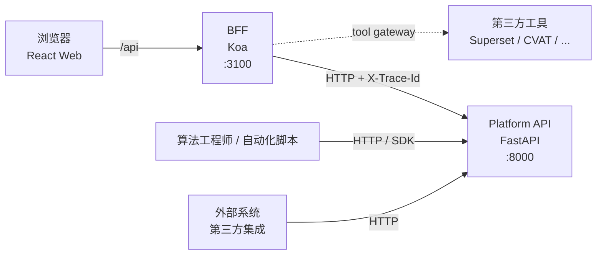

# API 总览

本项目对外提供 **三类 API**，分别服务不同消费方：

| 类型 | 文档 | 谁消费 | 职责 |
|---|---|---|---|
| **内部 Web/BFF/Platform API** | [internal-api.md](./internal-api.md) | Web 工作台 | 页面场景聚合 + ViewModel + auth + tool gateway |
| **外部 API & SDK** | [external-api-sdk.md](./external-api-sdk.md) | 算法工程师 / 自动化 / 外部团队 | 资源 CRUD + Dataset / Sample / Asset 消费 |
| **Tools 网关** | [微前端工具平台](../architecture/web-microfrontend-tools-platform.md) | 嵌入工具 | iframe 代理 + 注入 workspace context |

---

## 1. 端口与启动

| 服务 | 端口 | 启动命令 |
|---|---|---|
| Web (Vite) | 5173 | `pnpm dev:web` |
| BFF (Koa) | 3100 | `pnpm dev:bff` |
| Platform API (FastAPI) | 8000 | `make dev-api` |
| Orchestrator (Dagster) | 3001 | `make dev-dagster` |

或一键全启：`pnpm dev:local`

## 2. 三层 API 边界

| 层 | 定位 | 路径前缀 |
|---|---|---|
| Web → BFF | 页面级聚合、auth、ViewModel | `/api/...` |
| BFF → Platform API | 内部 HTTP 透传，注入 X-Trace-Id 等 | 由 BFF 内部 fetch |
| Platform API（外部） | 资源 CRUD / 业务逻辑 | `/api/v1/...` 或无前缀（legacy） |

## 3. 详细文档

- 内部契约：[Internal API](./internal-api.md)
- 外部消费：[External API & SDK](./external-api-sdk.md)

## 4. 通用约定

- **认证**：本地默认 `LocalAuthAdapter`（无认证）；生产 OIDC（profile 切换）
- **追踪**：所有请求带 `X-Trace-Id` header；BFF 自动透传到 Platform API；响应也回写
- **错误**：4xx 业务错误 + 5xx 系统错误；错误 body `{"detail": "..."}`
- **分页**：列表统一 `?limit=&offset=` 或 `?limit=&page=`
- **时间**：UTC ISO8601 字符串；clip 时间用 ns（BigInt）
