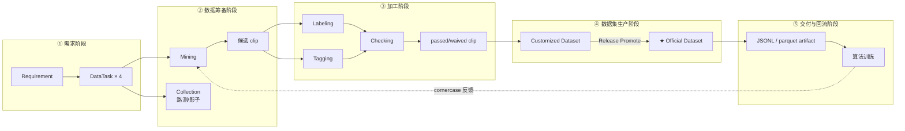
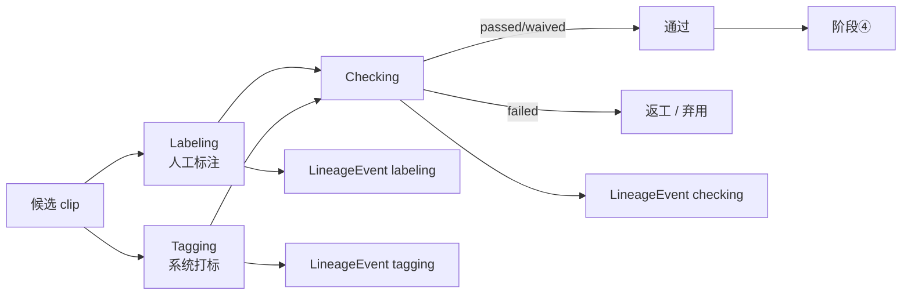
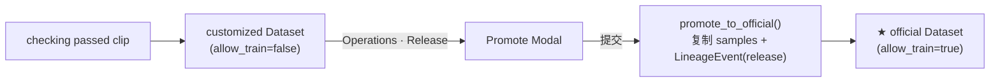
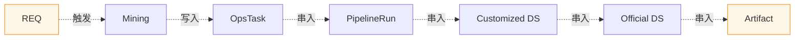

# 业务流程总览（水平分段）

> 父：[架构总览](./overview.md)
> 视角：把项目里所有「跨模块的水平流程」按阶段切片展开，每段说明触发条件、产出物、可观测点。
>
> **MECE 边界**：本文只讲业务流程；领域名词见 [术语澄清](./glossary-dataset-scenario-cornercase-tag-label.md)；底层引擎见 [系统分层](./system-layers.md)。

---

## 1. 全景（横向 5 段）

**关键不变量**：所有阶段共享同一 `x_trace_id`；每段产出可在 Web 任一视图按 trace 反查。

---

## 2. 阶段 ①：需求阶段

| 触发 | 产出 | 主要写表 |
|---|---|---|
| Dre / 产品在 Requirements 页提需求 | 1 行 Requirement + 4 行 DataTask | `requirements` / `data_tasks` |

- DataTask 4 类（**固定枚举**）：collection / annotation / quality_check / pipeline。
- 进入 ② 前必须 sign-off：每条 DataTask 状态从 `PENDING` → `APPROVED`。
- 链路标识 `x_trace_id` 此时尚未生成（在 ③ 第一次 Mining 触发时回填）。

详见 [模块 PRD · Requirement](../prd/module-requirement.md)。

---

## 3. 阶段 ②：数据筹备阶段

| 触发 | 产出 | 主要写表 |
|---|---|---|
| Sign-off 通过后排程 Mining | OperationsTask(mining) + N 条 OpsItem(候选 clip) | `operations_tasks` / `ops_items` |
| 路测 / 影子模式回流 | 触发同步 Mining ops_item，标 `disengagement_*` / `shadow_*` tag | `ops_items` + tag |

- 6 类 mining 来源（参见 [Cornercase 定义](./glossary-dataset-scenario-cornercase-tag-label.md#13-cornercase长尾场景--边界样本)）：disengagement / shadow / active learning / similarity / scenario mining / simulation seed。
- 此阶段产出"候选 clip 集合"——尚未标注 / 未质检。

---

## 4. 阶段 ③：加工阶段

| 子流程 | 产出 | 主要写表 |
|---|---|---|
| Labeling（人工标注） | OpsItem(status: pending → in_progress → review → done) + da_tags | `ops_items` |
| Tagging（系统打标） | OpsItem(status: applied) + 系统 tags | `ops_items` + `event_results.tags` |
| Checking（QA 质检） | OpsItem(status: passed / waived / failed) | `ops_items` |
| Pipeline 加工（可选） | PipelineRun（collect / clip-extract / feature-compute） | `pipeline_runs` + `assets` |

每个动作都写一条 `LineageEvent`，作为 Snowflake 中心事件源。

---

## 5. 阶段 ④：数据集生产阶段（核心）

| 子步骤 | 详细 |
|---|---|
| **Build customized** | 把通过 Checking 的 clip 收成一个 `Dataset(dataset_type='customized')`，每个 clip 一条 `DatasetSample`，`ts` 取自 Lance metadata 的 start/end 中点（或用户在 Explorer 灵活切割指定） |
| **Release Promote** | 创建一条 release `OpsItem(status=approved)` → 调 `dataset_slice_service.promote_to_official` → 复制 samples 到新 `Dataset(dataset_type='official', allow_train=true)`，写一条 `LineageEvent(event_type='release')`，把 OpsItem.status 推到 `published` |

**幂等保证**：`(dataset_id, clip_id, ts)` 唯一约束；重复 Promote 跳过已有 sample，写在 `samples_deduped` 计数。

详见 [Dataset + Snowflake 设计](./dataset-design.md)。

---

## 6. 阶段 ⑤：交付与回流阶段

| 子步骤 | 详细 |
|---|---|
| Export | 把 official Dataset 的 sample 列表导出 jsonl/parquet → `data/exports/<id>-v<n>.jsonl` |
| 登记 Asset | `Asset(asset_kind=derived, producer_event_id=release_event_id)` 把交付物纳入资产表 |
| 算法消费 | 通过 `/api/v1/datasets/:id/samples` 或 artifact 文件读样本 |
| Cornercase 回流 | 算法发现新 disagreement → 回到阶段 ② 触发新一轮 Mining |

---

## 7. 横切关注点

### 7.1 链路追踪（x_trace_id）

trace_id 在 HTTP header / 日志 / Dagster 任务参数 / Kafka header 全局传播。

### 7.2 Snowflake 事件流

每个动作（labeling / tagging / checking / mining / migration / flexible_cut / release）写一条 `LineageEvent`，每条 event 可关联 N 行 `EventResult`。4 个维度（tagging / labeling / checking / mining）通过 query filter 暴露，无独立物理表。

### 7.3 Asset 血缘

PipelineRun.input_uri / output_uri 仅作展示；真血缘走 `Asset.producer_pipeline_run_id` 与 `Asset.producer_event_id`。任意 derived asset 可反查产生它的 run / event。

---

## 8. 与底层分层的对应

| 业务阶段 | 调用的引擎层 | 数据落点 |
|---|---|---|
| ② Mining | Lance scan + DuckDB / DataFusion + 向量索引 | 仅元数据写库 |
| ③ Pipeline 加工 | Dagster asset + Lance write + DuckDB 质检 | `data/assets/` derived asset |
| ④ Build customized | Platform API + SQLite | `datasets_v2` / `dataset_samples_v2` |
| ④ Promote | Platform API + SQLite | 同上 + `lineage_events` / `event_results` |
| ⑤ Export | LanceTableAdapter / 文件写盘 | `data/exports/*` + `assets` 表登记 |

详见 [系统分层总览](./system-layers.md)。

---

## 9. 参考

- [整体产品 PRD](../prd/ai-data-loop-infra-prd.md)
- [E2E Demo 教程](../tutorials/e2e-demo.md)
- [PipelineRun 统一事实模型 ADR](../adr/adr-pipelinerun-unified-fact-model.md)
- [分层与编排边界](./layering-and-orchestrator-boundaries.md)
- [Local-First 流式演进](./local-first-streaming-evolution.md)
- [物理数据集管理系统](./build-phisical-dataset-manager-system.md)
