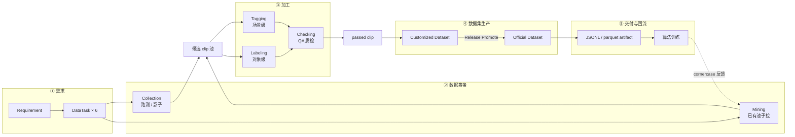
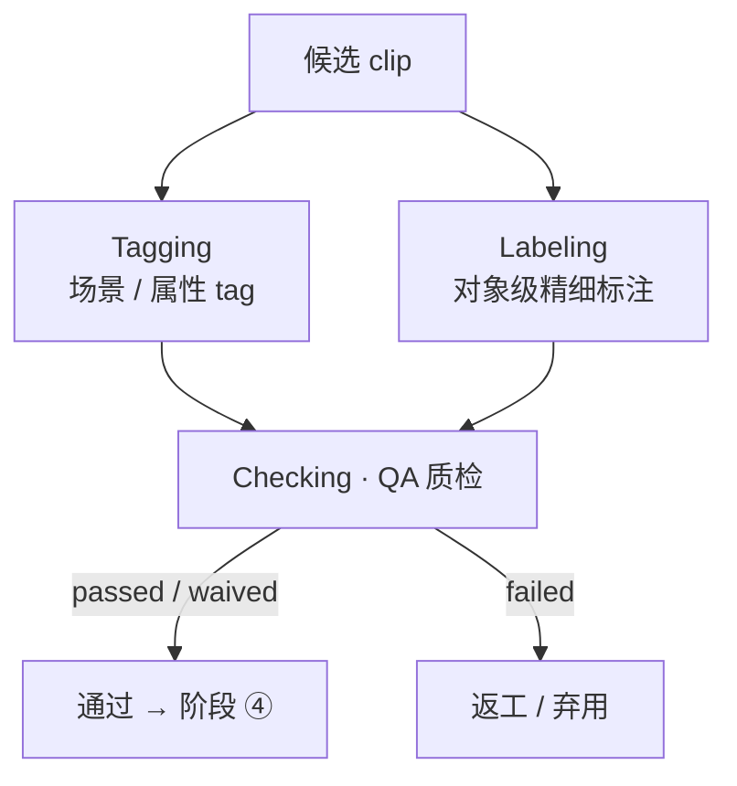
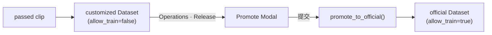
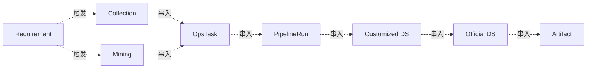

# 业务流程总览

> 父：[架构总览](./overview.md)
>
> 把跨模块水平流程按阶段切片展开，每段说明触发条件、产出物、可观测点。
>
> **MECE 边界**：本文只讲业务流程；领域名词见 [术语澄清](./glossary-dataset-scenario-cornercase-tag-label.md)；底层引擎见 [系统分层](./system-layers.md)；tags 字段细节见 [Tags 设计](./tags-design.md)。

---

## 一、TaskType：业务里程碑的 6 类

`DataTask.task_type` 表示"这一步承诺交付什么"。对齐 Tesla / Waymo / Cruise 等头部自动驾驶团队的数据闭环术语，固定 6 类：

| TaskType | 中文 | 产出 | 阶段 | 行业惯例 |
|---|---|---|---|---|
| `collection` | 数据采集 | 路测 / 影子模式回流的原始 clip | ② | Tesla 路测 + shadow mode 触发；Waymo 自有车队 |
| `mining` | 数据挖掘 | 从已有池子挖出的候选 clip | ② | 主动学习 / hard-negative mining / 相似度召回 |
| `tagging` | 场景打标 | 场景 / 属性 / 事件级 tag（夜间 / 路口 / 切入 / 雨） | ③ | "scene tagging" / "metadata tagging"，多走 auto-tagger |
| `labeling` | 精细标注 | 帧级 / 对象级标注（2D/3D bbox、seg、track、lane） | ③ | "labeling" 专指人工 + auto-pre-label 的精细标注 |
| `checking` | 质量校验 | passed / waived / failed 的 clip / sample | ③ | "QA gate" / "review" |
| `release` | 发版交付 | customized → official Dataset + artifact | ④ / ⑤ | "dataset release" / "training set freeze" |

**为什么 tagging 与 labeling 要分开？** 二者成本结构与人机配比完全不同：

- `tagging`：场景级、低维、自动化覆盖率高。一次跑一个 auto-tagger 模型可以把上千万 clip 都打上 `night` / `urban_intersection` / `cut_in` 这类高位 tag，人工只做抽样校对。
- `labeling`：对象级、高维、强人工。每个 bbox / 多边形 / 轨迹都需要标注员逐帧操作；auto-pre-label 仅是预填，最终质量靠人工。

把它们合在一个 `annotation` 里会让 ops 工作流、SLA、计费模型全部混乱。Tesla 的 auto-labeling pipeline、Waymo Open Dataset 的 metadata vs object label、Cruise 的 scenario tag vs annotation 都是分开建模。

---

## 二、全景（横向 5 段）

**关键不变量**：

- 全程共享 `x_trace_id`；任意视图按 trace 反查。
- Collection 与 Mining 在阶段 ② 内**平行**——一处理外部增量，一处理已有存量，下游不区分来源。
- Tagging 与 Labeling 在阶段 ③ 内**平行**——一做场景级覆盖，一做对象级精细，最后汇入同一个 Checking 口子。

---

## 三、阶段详情

### ① 需求

| 触发 | 产出 | 主要写表 |
|---|---|---|
| Dre / 产品提需求 | 1 行 Requirement + 6 行 DataTask | `requirements` / `data_tasks` |

进入 ② 前每条 DataTask 必须 `PENDING → APPROVED`。`x_trace_id` 在第一条 OperationsTask 创建时生成。详见 [模块 PRD · Requirement](../prd/module-requirement.md)。

### ② 数据筹备（业务难点之一）

> 决定算法能不能拿到对的数据，是收益最大的环节。

| 子流程 | 触发 | 产出 | 主要写表 |
|---|---|---|---|
| **Collection** | 路测车下线 / 影子模式回流 | 新原始 clip + Asset(raw) | `collection_jobs` / `assets` |
| **Mining** | sign-off 后排程 mining ops_task | OperationsTask + N 条候选 OpsItem | `operations_tasks` / `ops_items` |

两条产线平行，指针落同一张候选池表，下游不区分来源。

Mining 来源 6 类：disengagement / shadow / active learning / similarity / scenario mining / simulation seed（详见 [Cornercase 定义](./glossary-dataset-scenario-cornercase-tag-label.md#13-cornercase长尾场景--边界样本)）。

### ③ 加工（业务难点之二）

> 人工成本高、SLA 紧、错标返工链路最长。

| 子流程 | 产出 | 主要写表 |
|---|---|---|
| **Tagging** | OpsItem(applied) + 场景 / 属性 tag（auto + 人工） | `ops_items` + `clip_tags` |
| **Labeling** | OpsItem(pending → review → done) + 对象级标注 | `ops_items` + `event_results` |
| **Checking** | OpsItem(passed / waived / failed) | `ops_items` |

每个动作都写一条 `LineageEvent`（labeling / tagging / checking），作为 Snowflake 中心事件源。Tagging 写 `clip_tags`，Labeling 写 `event_results`（带几何与对象 schema），二者沉淀到不同物理表，但都通过 `x_trace_id` 与 `clip_id` 串回。

> Tagging 与 Labeling 也可以串行：先 Tagging 自动覆盖大盘，再用 tag 决定哪些 clip 进 Labeling 队列。这是常见的成本优化策略，但不影响 5 阶段的横向骨架。

### ④ 数据集生产（工程问题）

| 子步骤 | 详细 |
|---|---|
| Build customized | passed clip 灵活切割成 `DatasetSample`（一条 clip 可切多条），落 `Dataset(dataset_type='customized')`；`ts` 取 Lance metadata start/end 中点或 Explorer 指定 |
| Release Promote | release `OpsItem(approved)` → `dataset_slice_service.promote_to_official` → 复制 samples 到 `Dataset(dataset_type='official', allow_train=true)`，写 `LineageEvent(release)`，OpsItem 推到 `published` |

**幂等**：`(dataset_id, clip_id, ts)` 唯一约束；重复 Promote 跳过已有 sample，写入 `samples_deduped` 计数。详见 [Dataset + Snowflake 设计](./dataset-design.md)。

### ⑤ 交付与回流

| 子步骤 | 详细 |
|---|---|
| Export | official Dataset 的 sample 列表导出 jsonl / parquet → `data/exports/<id>-v<n>.jsonl` |
| 登记 Asset | `Asset(asset_kind=derived, producer_event_id=release_event_id)` |
| 算法消费 | `/api/v1/datasets/:id/samples` 或 artifact 文件 |
| Cornercase 回流 | 算法发现 disagreement → 阶段 ② 触发新一轮 Mining |

> **术语**：clip = Lance 文件层片段；sample = Dataset 在 clip 上灵活切割得到的训练样本。一条 clip 可切多条 sample，二者不是同义词。

---

## 四、横切关注点

### 4.1 x_trace_id

trace_id 在 HTTP header / 日志 / Dagster 任务参数 / Kafka header 全局传播。

### 4.2 Snowflake 事件流

每个动作（tagging / labeling / checking / mining / migration / flexible_cut / release）写一条 `LineageEvent`，关联 N 行 `EventResult`。4 个查询视图维度（tagging / labeling / checking / mining）通过 query filter 暴露，无独立物理表。

### 4.3 Asset 血缘

`PipelineRun.input_uri` / `output_uri` 仅作展示；真血缘走 `Asset.producer_pipeline_run_id` 与 `Asset.producer_event_id`。任意 derived asset 可反查产生它的 run / event。

### 4.4 Tags：人工 + 自动 + 算法版本

`clip_tags` 是与 clip 一对多的结构化记录，每行带：

| 字段 | 用途 |
|---|---|
| `name` | tag 名（`night` / `intersection` / `vru-pedestrian` / `cut_in`） |
| `source` | `manual` / `auto_tagging` / `auto_labeling` / `rule` / `import` |
| `source_version` | auto 类填模型版本（`auto-tagger@v3.2`）；manual 类填 `user:<email>` |
| `confidence` | auto 类必填 0–1；manual 一般为 NULL |
| `applied_at` | 时间戳 |
| `notes` | 额外上下文（model_run_id / rule_id / reviewer notes） |

完整 schema、人工 vs 自动的来源约束、算法版本的兼容策略详见 [Tags 设计](./tags-design.md)。

### 4.5 Pipeline 在各阶段的分布

| 阶段 | 典型 PipelineRun | 附着的 DataTask |
|---|---|---|
| ② Collection | clip-extract / 隐私脱敏 / 上传打包 | collection |
| ② Mining | 特征提取 / 向量召回 / cornercase 评分 | mining |
| ③ Tagging | auto-tagger 推理 / rule engine 匹配 | tagging |
| ③ Labeling | auto-pre-label / reviewer routing | labeling |
| ③ Checking | auto-QC-gate / 抽样复核 | checking |
| ④ / ⑤ Release | manifest 生成 / artifact 打包 / Asset 登记 | release |

---

## 五、与系统分层的对应

| 业务阶段 | 调用的引擎层 | 数据落点 |
|---|---|---|
| ② Collection | 上传 / 脱敏 pipeline + Lance write | `data/raw/` raw asset |
| ② Mining | Lance scan + DuckDB / DataFusion + 向量索引 | 仅元数据写库 |
| ③ Tagging | auto-tagger 推理 + DuckDB upsert | `clip_tags` 表 |
| ③ Labeling | Dagster asset + Lance write + DuckDB 质检 | `data/assets/` derived asset + `event_results` |
| ④ Build customized | Platform API + SQLite | `datasets_v2` / `dataset_samples_v2` |
| ④ Promote | Platform API + SQLite | + `lineage_events` / `event_results` |
| ⑤ Export | LanceTableAdapter / 文件写盘 | `data/exports/*` + `assets` 表登记 |

详见 [系统分层总览](./system-layers.md)。

---

## 六、参考

- [整体产品 PRD](../prd/ai-data-loop-infra-prd.md)
- [E2E Demo 教程](../tutorials/e2e-demo.md)
- [Dataset + Snowflake 设计](./dataset-design.md)
- [Tags 设计](./tags-design.md)
- [PipelineRun 统一事实模型 ADR](../adr/adr-pipelinerun-unified-fact-model.md)
- [分层与编排边界](./layering-and-orchestrator-boundaries.md)
