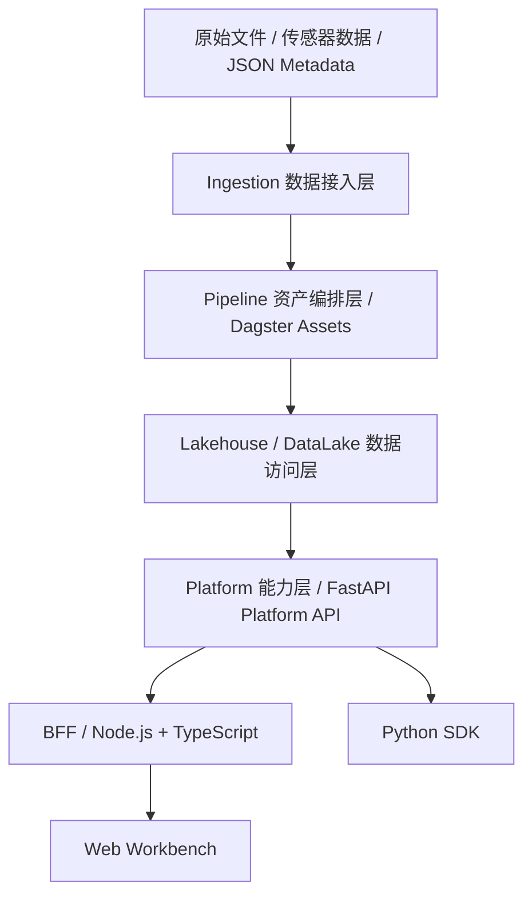
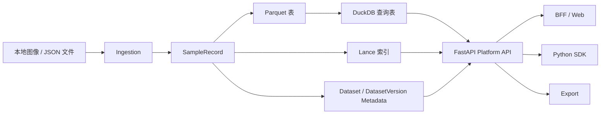
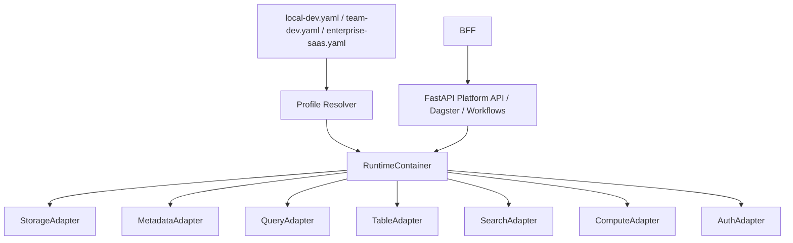
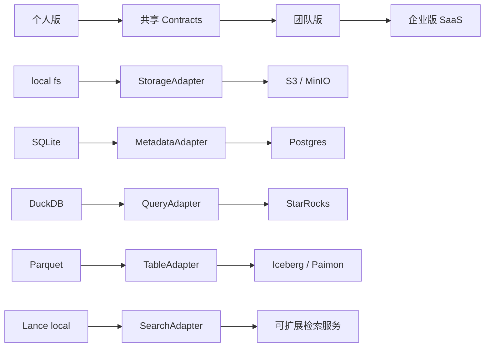

# Mermaid 架构图

## 系统分层图

```mermaid
flowchart TD
    A[原始文件 / 传感器数据 / JSON Metadata] --> B[Ingestion 数据接入层]
    B --> C[Pipeline 资产编排层 / Dagster Assets]
    C --> D[Lakehouse / DataLake 数据访问层]
    D --> E[Platform 能力层 / FastAPI Platform API]
    E --> F[BFF / Node.js + TypeScript]
    F --> G[Web Workbench]
    E --> H[Python SDK]
```

## 本地 MVP 数据流

```mermaid
flowchart LR
    A[本地图像 / JSON 文件] --> B[Ingestion]
    B --> C[SampleRecord]
    C --> D[Parquet 表]
    D --> E[DuckDB 查询表]
    C --> F[Lance 索引]
    C --> G[Dataset / DatasetVersion Metadata]
    E --> H[FastAPI Platform API]
    F --> H
    G --> H
    H --> I[BFF / Web]
    H --> J[Python SDK]
    H --> K[Export]
```

## 运行时抽象图

```mermaid
flowchart TD
    A[local-dev.yaml / team-dev.yaml / enterprise-saas.yaml] --> B[Profile Resolver]
    B --> C[RuntimeContainer]
    C --> D[StorageAdapter]
    C --> E[MetadataAdapter]
    C --> F[QueryAdapter]
    C --> G[TableAdapter]
    C --> H[SearchAdapter]
    C --> I[ComputeAdapter]
    C --> J[AuthAdapter]
    K[FastAPI Platform API / Dagster / Workflows] --> C
    L[BFF] --> K
```

## 演进路径图

```mermaid
flowchart LR
    A[个人版] --> B[共享 Contracts]
    B --> C[团队版]
    C --> D[企业版 SaaS]

    A1[local fs] --> B1[StorageAdapter] --> D1[S3 / MinIO]
    A2[SQLite] --> B2[MetadataAdapter] --> D2[Postgres]
    A3[DuckDB] --> B3[QueryAdapter] --> D3[StarRocks]
    A4[Parquet] --> B4[TableAdapter] --> D4[Iceberg / Paimon]
    A5[Lance local] --> B5[SearchAdapter] --> D5[可扩展检索服务]
```
