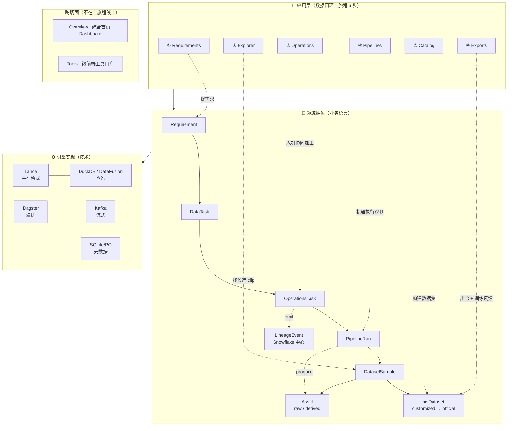

# 架构总览

`AI Native Data Engine` 是面向自动驾驶 / 机器人数据闭环的平台型 monorepo。从「本地优先」的个人开发版起步，通过稳定的抽象层演进到团队版与企业版，不需要中途重写。

> **导航**：本文是架构章节入口。深入阅读路径：
> ① [**领域模型**](./glossary-dataset-scenario-cornercase-tag-label.md)：5 个核心名词与对象关系
> ② [**业务流程**](./business-flows.md)：横向闭环（Requirement → Dataset）的可观测段
> ③ [**系统分层**](./system-layers.md)：六层模型每层的技术与状态

---

## 一、三视角看清架构

### 1.1 核心抽象一图打通



### 1.2 业务流程一句话

```
Requirement → 5 个 DataTask（业务里程碑）→ N 个 OperationsTask（人机协同）
            → N 条 PipelineRun（机器执行）→ customized Dataset
            → Promote 为 official Dataset → 算法工程师消费
```

横向 9 步全景见 [E2E Demo 教程](../tutorials/e2e-demo.md)；阶段细节见 [业务流程总览](./business-flows.md)。

### 1.3 系统分层一句话

**六层底座 + 一层正交**：文件格式 / 存储 / 湖表格式 / 计算 / 查询 / 应用 + 元数据&事务控制。

每层的技术选型与切换代价见 [系统分层总览](./system-layers.md)。

---

## 二、统一架构表

| 层级 | 核心职责 | 代表技术 | local-first MVP |
|---|---|---|---|
| 文件格式层 | 编码 / 落盘 / 索引表达 | Parquet / Lance / Mcap / Lerobot | Lance |
| 存储层 | 文件与对象保存 | local fs / S3 / MinIO / OSS / HDFS | local fs |
| 湖表格式层 | 表快照 / schema 演进 / 分区 / 事务 | Iceberg / Paimon / Hudi | 裸文件集（演进位） |
| 计算层 | ingestion / 物化 / 编排 / 批流 | local Python / Dagster / Spark / Flink / Fluss | local Python + Dagster |
| 查询层 | SQL 聚合 / 交互式分析 | DuckDB / Trino / StarRocks | DuckDB |
| 应用层 | 角色化产品入口 | Web / BFF / FastAPI / SDK / BI | Web + BFF + FastAPI + SDK |

SQLite / Postgres 作为正交的 **元数据与事务控制层**，承载 dataset / 版本 / 任务 / 导出 / 血缘 / 权限 / 审计等控制状态。

---

## 三、核心设计原则

1. **数据模型优先**。围绕数据资产组织，而非围绕文件路径或基础设施产品。资产主线：`Raw → RawRecord → Clip → Scenario → Dataset → DatasetVersion → JobRun → ExportJob → LineageEvent`。
2. **按访问模式分层**。每种访问模式对应一个 adapter：`Metadata` / `Query` / `Search` / `Table` / `Storage` / `Compute` / `Auth`。底层 provider 切换走 adapter + profile，不需要重写产品。
3. **资产导向编排**。Dagster 用于建模 dataset / distribution / export / lineage 资产及其依赖，而非纯脚本调度。
4. **本地优先、可演进**。从「一台笔记本可启动」的配置起步，通过 profile 逐步切换 provider。

---

## 四、Platform 层内部边界

访问路径：

```text
Web → BFF → Platform API → RuntimeContainer / adapters
```

跨语言共享的不是 Python 代码，而是 Platform API 暴露的稳定 HTTP / JSON contract——Node.js BFF 与 Python 平台层共享同一套资源语义、字段结构与状态约定。

| 模块 | 职责 |
|---|---|
| `apps/web` | UI 呈现 |
| `apps/bff` | 浏览器接入 / 会话 / 页面聚合 / ViewModel |
| `apps/api` | 平台资源语义、Platform API contract、SDK / 自动化访问 |
| `python/core` | 领域模型、接口定义、capability contracts |
| `python/adapters` | DuckDB / Lance / SQLite / filesystem 等具体实现 |
| `python/workflows` | 查询 / 导出 / 调度 / 编排等框架中立的应用服务逻辑 |
| `apps/<app>/src/services/` | 进程内事务型服务（与 SQLAlchemy session / FastAPI 生命周期绑定） |

BFF 不拥有底层数据资产事实，不直接持有 runtime provider。详细的目录边界与判定规则见 [分层与编排边界](./layering-and-orchestrator-boundaries.md)。

工作台关键产品链路是 clip-centric：

```text
Requirement → Explorer/Search → Clip Detail → 上卷回 Requirement / Catalog
Catalog（按 scenario 聚合 dataset）→ Explorer/Clips → Clip Detail → 上卷回 Dataset
```

---

## 五、运行时装配

`RuntimeContainer` + `infra/profiles/<env>.yaml` + `python/profiles` resolver 决定运行时能力：

- Platform API / workflow / Dagster definitions 依赖的是 capability，不直接依赖 DuckDB / SQLite / Lance / local fs；
- BFF 通过 Platform API 间接消费，不直接与底层 provider 耦合。

切换 provider 只需换 profile，不动产品代码。

---

## 六、参考

- [系统分层总览](./system-layers.md)
- [分层与编排边界](./layering-and-orchestrator-boundaries.md)
- [业务流程总览](./business-flows.md)
- [Dataset + Snowflake 设计](./dataset-design.md)
- [PipelineRun 统一事实模型 ADR](../adr/adr-pipelinerun-unified-fact-model.md)
