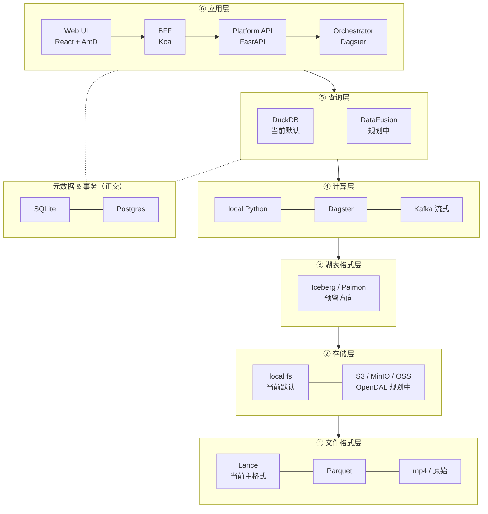

# 系统分层总览（六层 + 一层正交）

> 父：[架构总览](./overview.md)
> 视角：把项目所有「技术组件」按分层模型归位，每层说明**当前用什么 / 未来切什么 / 切换的代价**。
>
> **MECE 边界**：本文只讲技术分层；业务流程见 [业务流程总览](./business-flows.md)。

---

## 0. 分层全景



---

## 1. ① 文件格式层（File Format Layer）

| 项 | 当前 | 未来 | 切换代价 |
|---|---|---|---|
| 主格式 | **Lance**（v0.x，列式 + 向量原生） | 维持，不切 | — |
| 训练样本/中间表 | Lance + Parquet | Parquet（行组级 IO 更快） | 低：TableAdapter 已抽象 |
| 视频 | mp4（原始） | 同 + 多分辨率 | 低 |
| 标注 schema | Lance 列（bbox / track 多模态） | 引入 mcap / Lerobot | 中：需 schema converter |

**为什么是 Lance**：
- 原生支持向量列 + 多模态对齐（image / lidar / can）
- DataFusion 同源生态
- Append + 增量索引能力优于 Parquet

详见 [Clip + Lance 数据模型](./clip-lance-data-model.md)。

---

## 2. ② 存储层（Storage Layer）

| 项 | 当前 | 未来 | 切换代价 |
|---|---|---|---|
| 默认 | local fs | S3 / MinIO / OSS / GCS / Azure | 低：StorageAdapter 已抽象 |
| 抽象 | 自研 `LocalFileStorageAdapter` + `S3StorageAdapter` | OpenDAL 统一接管 30+ 后端 | 已规划新增 `OpenDALStorageAdapter`，与现有共存 |
| 协议 | put/get/list/delete | + range read（视频流式） + multipart + signed URL | 低 |

**为什么共存而非替换**：personal 默认零依赖，team / SaaS 走 OpenDAL；profile 切换不重写代码。

详见 [技术选型：DataFusion / OpenDAL](../adr/tech-selection-datafusion-opendal.md)。

---

## 3. ③ 湖表格式层（Lakehouse Format Layer）

| 项 | 当前 | 未来 | 切换代价 |
|---|---|---|---|
| 格式 | **裸文件集**（Lance + Parquet 直接落盘） | Iceberg / Paimon | 中：TableAdapter 已留位 |
| 事务 | 无（依赖 SQLite 元数据兜底） | Iceberg snapshot + ACID | 高：写入路径需重构 |
| schema 演进 | 手动 alembic | Iceberg schema evolution | 中 |
| 时间旅行 | 通过 dataset_version + DatasetSnapshotManifest 模拟 | Iceberg snapshot id | 中 |

**为什么不立即上**：当前 dataset_version + snapshot manifest 在单机够用；引入 Iceberg / Paimon 会拉来 catalog 服务（HMS / Polaris / RestCatalog）依赖，到团队/SaaS 阶段再上。

详见 [FDL 集成](./fdl-integration.md)。

---

## 4. ④ 计算层（Compute Layer）

| 项 | 当前 | 未来 | 切换代价 |
|---|---|---|---|
| 编排 | **Dagster Local**（asset-based） | Dagster Cloud / Temporal / Airflow | 低：ComputeAdapter 已抽象 |
| 批处理 | local Python + Lance write | Spark on K8s / Ray | 中：业务 asset 改 |
| 流式 | Kafka local + 自研 trigger（kafka_trigger.py） | Flink / Fluss / KSQL | 中：streaming 模型已分离 |
| 任务执行 | uv 启动 Python | 容器化 / serverless | 低 |

**3 类 PipelineRun 共存**：
- `trigger_source=data_task / operations_task` —— Web 触发的常规 run
- `trigger_source=scheduler` —— Dagster 定时
- `trigger_source=external` —— Kafka 流式回填的 streaming-replay run

详见 [分层与编排边界](./layering-and-orchestrator-boundaries.md) + [Local-First 流式演进](./local-first-streaming-evolution.md)。

---

## 5. ⑤ 查询层（Query Layer）

| 项 | 当前 | 未来 | 切换代价 |
|---|---|---|---|
| 默认引擎 | **DuckDB**（cursor 模式 + Arrow register） | DataFusion（Lance native） + StarRocks（多租户分布式） | 低：QueryAdapter 已抽象 |
| 用法 | GROUP BY scene / WHERE has_lane_marking / read_json_auto | + window / 流式 / push-down 到 Lance | 低 |
| 调用方 | apps/api 路由、Dagster asset 质检 | 同 | — |

**渐进策略**：
- DuckDB 留作 Web UI 即席分析默认
- 新增 `DataFusionQueryAdapter` 用于 Lance-native 路径与 streaming
- profile.query.engine 切换；contract test 兜底两 backend 行为一致

详见 [技术选型：DataFusion / OpenDAL](../adr/tech-selection-datafusion-opendal.md)。

---

## 6. ⑥ 应用层（Application Layer）

```
┌──────────────────────────────────────────────────────────┐
│  Web (React + AntD)                                      │
│  6 模块：Catalog / Requirement / Explorer / Operations / │
│         Pipelines / Tools                                │
└─────────────────┬────────────────────────────────────────┘
                  │ /api（Vite proxy）
                  ▼
┌──────────────────────────────────────────────────────────┐
│  BFF (Koa + koa-joi-router) — port 3100                  │
│  职责：proxy + ViewModel + auth + tool gateway           │
└─────────────────┬────────────────────────────────────────┘
                  │ HTTP
                  ▼
┌──────────────────────────────────────────────────────────┐
│  Platform API (FastAPI) — port 8000                      │
│  职责：业务 CRUD / Snowflake / Dataset Promote /         │
│       Asset 登记 / 流式产物落库                            │
└─────────────────┬────────────────────────────────────────┘
                  │ profile-driven
                  ▼
┌──────────────────────────────────────────────────────────┐
│  Adapters（python/adapters）                              │
│  query / table / vector / storage / metadata /           │
│  compute / auth / catalog                                │
└──────────────────────────────────────────────────────────┘
                  │
                  ▼
┌──────────────────────────────────────────────────────────┐
│  Orchestrator (Dagster) — port 3001                      │
│  asset-based 数据资产物化                                 │
└──────────────────────────────────────────────────────────┘
```

详见：
- [Web 访问层 / BFF 架构](./web-access-layer-bff-architecture.md)
- [微前端工具平台](./web-microfrontend-tools-platform.md)
- [Monorepo 模块划分](./monorepo-modules.md)
- [Core / Adapters / Profiles / Workflows 分层](./core-adapters-profiles-workflows.md)

---

## 7. 元数据与事务控制（正交层）

| 项 | 当前 | 未来 |
|---|---|---|
| 业务 DB | SQLite（apps/api → `data/metadata/requirement.db`） | Postgres |
| catalog adapter DB | SQLite（`data/metadata/metadata.db`） | Postgres / 共享 |
| clip 索引 | SQLite（`data/metadata/clip_catalog.sqlite`） | DuckDB / Lance native |
| 缓存 / 事务协调 | 无 | Redis / OpenSearch |

不归入六层主链，但每个上层都依赖它做 ACID + 元数据查询。

---

## 8. 一句话总结

| 层 | 当前 | 主要演进点 |
|---|---|---|
| ① 文件格式 | Lance | 维持 |
| ② 存储 | local fs | OpenDAL 多云 |
| ③ 湖表格式 | 裸文件 | Iceberg / Paimon（团队/SaaS 阶段） |
| ④ 计算 | local Python + Dagster + Kafka | Spark / Flink / Ray |
| ⑤ 查询 | DuckDB | DataFusion + StarRocks |
| ⑥ 应用 | Web + BFF + FastAPI + Dagster | 维持，新增 ACL / 多租户 |
| 正交 | SQLite | Postgres + Redis |

**核心设计原则**：每层都有 adapter 抽象，profile 切换不重写代码——这是项目能从 personal 演进到 SaaS 的关键。
