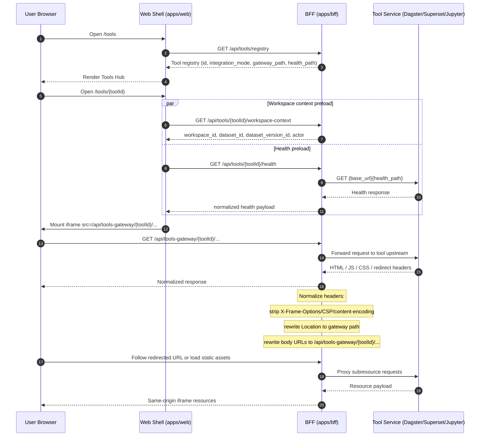

# Web Microfrontend Tools Platform

## Goal

Use the existing web shell as the single platform entry point, while integrating specialized big-data tools such as Dagster, Superset, and Jupyter as independently owned micro-apps.

This design avoids two bad extremes:

- rebuilding every vendor UI feature inside `apps/web`
- exposing users to three disconnected products with separate entry points and no shared context

## Core principle

The shell owns platform concerns. Embedded tools own specialist workflows.

Shell responsibilities:

- global navigation
- tenant and workspace context
- permission checks
- audit and request correlation
- cross-tool discovery and launch
- future event bridge and context handoff

Tool responsibilities:

- workflow orchestration UI in Dagster
- BI authoring and dashboards in Superset
- notebook interaction and kernels in Jupyter

## Target architecture

```text
Web Shell
-> Tool Registry
-> Tool Workspace Route
-> Access Gateway
-> Embedded Tool Runtime

Shared platform services
-> auth/session
-> context bridge
-> audit/request-id
-> favorites/recent tools
-> deep-link resolver
```

More concretely:

```text
apps/web
  -> platform shell
  -> microfrontend registry
  -> workspace routes: /tools/:toolId
  -> bridge SDK for context and events

apps/bff
  -> /tools-gateway/dagster/*
  -> /tools-gateway/superset/*
  -> /tools-gateway/jupyter/*
  -> session normalization
  -> auth/token exchange
  -> CSP/X-Frame-Options normalization where allowed

Tool services
  -> dagster-webserver
  -> superset
  -> jupyter
```

## Engine layers

### 1. Shell layer

Located in `apps/web`, this is the persistent frame around all tools.

It should own:

- app header
- primary navigation
- secondary workspace navigation
- route transitions
- launch actions
- tool directory

It should not replicate Dagster runs tables, Superset dashboard builders, or notebook editors unless a platform-native summary is specifically needed.

### 2. Registry layer

Each tool is declared as metadata, not hardcoded ad hoc into route components.

A descriptor should include:

- `id`
- `name`
- `entry url`
- `integration mode`
- `gateway path`
- `health path`
- capability summary
- notes about embedding or auth constraints

This lets the shell render a consistent launch catalog and workspace routes while keeping adapter logic explicit.

#### Current registration mechanism (implemented)

In this repository, tool registration is now owned by the BFF (not by Platform API).

Source of truth:

- `apps/bff/src/services/tools.ts`
- `TOOL_DEFINITIONS` in the BFF service layer

Runtime assembly:

- Base URLs come from BFF config (`TOOL_DAGSTER_BASE_URL`, `TOOL_SUPERSET_BASE_URL`, `TOOL_JUPYTER_BASE_URL`)
- Gateway path is derived as `/api/tools-gateway/{toolId}/`

Registry API (BFF):

- `GET /api/tools/registry`
- returns `items[]` with metadata used by `apps/web`:
  - `id`, `name`, `short_name`, `category`
  - `integration_mode`
  - `base_url`, `gateway_path`
  - `health_path`, `workspace_path`
  - `capabilities`, `use_cases`, `notes`

Why BFF-owned registry:

- avoids an extra `Web -> BFF -> Platform API` hop for shell-level integration metadata
- keeps app-facing integration concerns (routing, embedding, gateway path policy) close to the access layer
- reduces coupling between tool UX integration and platform resource semantics

### 3. Access gateway layer

Direct browser-to-tool embedding is acceptable for local dev, but not strong enough for production.

The BFF gateway should become the stable ingress for embedded tools because it can unify:

- user session propagation
- request IDs
- permission checks
- audit headers
- reverse proxy routing
- path rewriting
- CSP/frame policies where configurable

Recommended routes:

- `/api/tools-gateway/dagster/*`
- `/api/tools-gateway/superset/*`
- `/api/tools-gateway/jupyter/*`

#### Current proxy mechanism (implemented)

The active ingress exposed to browser clients is:

- `/api/tools-gateway/{toolId}/*`

Implemented in:

- `apps/bff/src/middlewares/tools-gateway-proxy.ts`

Pipeline behavior:

1. Route match and target resolution
- parse `toolId` from gateway path
- validate against known tool set (`dagster`, `superset`, `jupyter`)
- map to configured upstream base URL

2. Upstream request shaping
- preserve request method/path/query
- drop hop-by-hop headers
- force `accept-encoding: identity` so text payload rewriting is deterministic

3. Upstream response header normalization
- remove embedding-blocking headers:
  - `x-frame-options`
  - `content-security-policy`
- remove transfer-specific headers handled by BFF/body rewrite:
  - `content-length`
  - `content-encoding`
- rewrite `location` header for same-origin redirect continuity

4. Response body rewrite (text-like content only)
- rewrite absolute origin references to gateway base
- rewrite known tool path prefixes to gateway-prefixed paths
- prevent double-prefix rewrite via guarded regex strategy
- apply Superset-specific bootstrap rewrite so `application_root` stays under gateway path

Result:

- iframe subresource requests (e.g. `/_next/*`, `/static/*`, `/api/*`) stay within gateway namespace
- post-login redirects remain on gateway paths instead of leaking to shell root paths
- local embedding works despite default tool CSP/frame restrictions

Operational note:

- this gateway is an access-layer embedding adapter; it should not become a generic API passthrough for platform business resources

#### Web -> BFF -> Tool Service sequence (Mermaid)



### 4. Tool bridge layer

Over time, the shell needs a light bridge contract for cross-app context passing.

Examples:

- open Jupyter with `datasetId`, `datasetVersionId`, `sampleIds`
- open Dagster filtered to a run, asset key, or sensor
- open Superset on a curated dashboard for the current dataset

Bridge payload shape should stay small and platform-oriented:

- workspace ID
- dataset ID
- dataset version ID
- scenario ID
- task ID
- actor/user metadata

Avoid inventing a giant cross-tool domain model.

## Integration modes

Two modes are enough for the first generation.

### Direct iframe

Use for local development or tools that already permit framing.

Pros:

- fastest to stand up
- minimal infrastructure

Cons:

- weak auth unification
- CSP and cookie problems
- difficult production hardening

### Proxy iframe

Use when the shell should embed a tool through a BFF-managed gateway.

Pros:

- consistent origin from the browser perspective
- easier auth and audit integration
- better long-term governance

Cons:

- requires proxy implementation and header policy work

## Tool-specific guidance

### Dagster

Best fit for embedded operator workflows.

Use cases:

- inspect asset health
- inspect runs
- trigger or re-run materializations
- follow orchestration state from platform tasks

Recommended integration:

- local dev: direct iframe
- production: gateway-backed iframe

### Superset

Useful as a BI micro-app, but usually requires more embedding discipline.

Use cases:

- curated dashboards
- SQL lab access for analysts
- metric exploration linked from datasets and exports

Recommended integration:

- local dev: either direct iframe or open-in-new-tab fallback
- production: gateway plus proper embed/session strategy

### Jupyter

Best treated as a notebook workspace micro-app rather than as a component-level embed.

Use cases:

- open a notebook with current dataset context
- inspect exported artifacts
- run exploratory validation steps

Recommended integration:

- local dev: direct iframe is acceptable if the environment allows it
- production: gateway and stronger per-user isolation

## Current implementation in this repo

The first slice should do the following:

- add a `Tools` module to `apps/web`
- define a shared microfrontend registry
- create `/tools` as the launch hub
- create `/tools/dagster`, `/tools/superset`, `/tools/jupyter` as workspace routes
- render each tool in a dedicated workspace panel with open-in-new-tab fallback

This is intentionally an engine skeleton, not the final platform integration.

## Next steps

1. Add role- and tenant-aware launch policy to registry responses.
2. Define a small shell-to-tool context bridge.
3. Extend health checks with per-tool diagnostics and SLO metadata.
4. Introduce favorites/recent tools persistence.
5. Add deep-link launchers from datasets, runs, tasks, and exports into the relevant tool workspace.