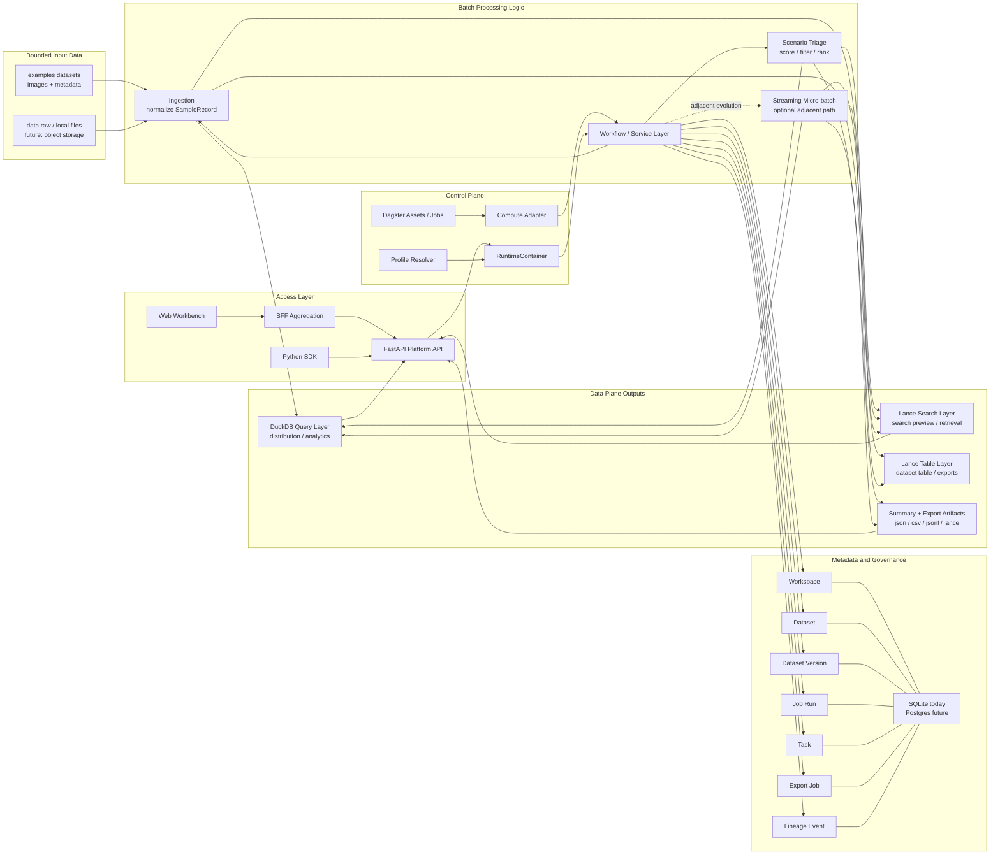

# chapter11_batch_processing

## 1. 我对第11章的整体理解

第11章讨论的是 **Batch Processing**：对**有界、只读**的输入数据集做离线处理，生成新的输出数据集。它和在线系统不同，核心目标通常不是低延迟，而是**高吞吐、可重跑、可调试、少副作用**。

作者把分布式批处理系统拆成了三个核心层：

- **orchestration layer**：决定任务何时、在哪运行
- **storage layer**：保存输入、输出和中间数据
- **computation layer**：真正执行数据处理逻辑

这套抽象对理解自动驾驶数据闭环特别有帮助。因为自动驾驶里的很多工作，本质上就是典型批处理：

- 车端回传数据后的等齐、解析、切分、脱敏
- Clip/Topic/Slice/Dataset 构建
- 折损分析、成本核算、质量巡检
- 标注前预处理、标注后质检
- 特征整理、训练集构建、批量推理、评测回灌
- 北极星指标、ROI、NPS、用户反馈等离线分析

我设想的自动驾驶闭环拆成：**采集接入层、云端 pipeline 加工层、多模态湖仓层、数据应用层**，其目标是形成数据飞轮，支撑模型快速迭代。这和 DDIA 对批处理系统的理解非常一致：**批处理不是孤立 job，而是支撑数据生产、分析、训练、评测的一整套基础设施**。

---

## 2. 结合自动驾驶数据闭环的 use case 思考

### 2.1 自动驾驶数据闭环天然是批处理重度场景

DDIA 提到，批处理非常适合：

- ETL pipeline
- analytics
- machine learning
- 生成服务下游系统所需的派生数据

这几类，自动驾驶数据闭环几乎全中。

### 2.2 数据采集与回流后的加工链路

自动驾驶数据从车端回流后，首先进入云端加工链路，做多传感器等齐、解析、切分、脱敏、质检等处理。这些任务通常具备几个特征：

- 输入数据量大
- 处理逻辑相对稳定
- 对实时性要求通常低于在线链路
- 更关注吞吐、稳定性和可重跑

即便主链路是流式，周边仍然会有大量 batch workload，比如历史数据 backfill / 重跑、Dataset 构建、训练样本整理、成本分析、Raw Data 生命周期治理

### 2.3 湖仓中的 ETL 与数据资产化

DDIA 把 ETL 视为批处理最常见场景之一。你的材料中也提到：

- 原始视频、Clip、Stream、Subrun、CornerCase、Scenario、Dataset、Model、OTA 版本等都应被管理为资产
- 数据血缘、成本、质量、生命周期需要统一治理

这意味着自动驾驶数据闭环里的 batch processing 不只是“处理数据”，还承担了 **把原始资源转化为可管理数据资产** 的职责。

### 2.4 训练、批量推理与评测

DDIA 明确指出，机器学习广泛依赖 batch processing，包括：

- feature engineering
- model training
- batch inference

你的架构里也明确提出，训推平台无缝对接模型训练、批推理和仿真评测，并提供高速数据加载能力。  
因此在自动驾驶里，batch processing 不是辅助角色，而是训练闭环的主干。

### 2.5 运营分析与问题闭环

DDIA 也强调 batch jobs 非常适合 analytics 和 pre-aggregation。  
你的文档中则把这部分具体化为：

- 全链路折损分析
- 存储成本分析
- 北极星指标看板
- 模型质量评估
- OTA 运营
- 用户反馈和问题定位

这些任务通常不是秒级响应，而是面向周期性分析、问题定位和决策支持，因此非常适合批处理系统。

---

## 3. 一小段话总结 DFS / 分布式文件系统

**分布式文件系统可以理解为“多台机器共同组成的一套文件系统”**：大文件会被切分成多个 block，分散存储在不同机器上，并通过复制、缓存和元数据服务来保证容量、吞吐和容错；对上层批处理框架来说，它就像单机 Unix 系统里的文件系统一样，是输入、输出和中间结果的基础存储层。

放到自动驾驶场景里，传统 DFS 的角色正逐渐被 **对象存储 OSS/S3 + 湖仓表格式** 替代，但本质作用没变：仍然是在承接超大规模训练数据、视频、点云、元数据和中间产物的存储底座。

---

## 4. MapReduce 的意义：为什么它重要，但又不是今天的主角

DDIA 认为，现代 batch processing 深受 MapReduce 影响，但它已经是一个**较低层、较过时**的编程模型；今天实践中更多使用 Spark、Flink、数据仓库查询引擎，以及 SQL、DataFrame API 等更高层接口。

这一点非常契合自动驾驶闭环里的工程现实：

- 数据工程师大量写 ETL SQL
- 算法和 MLE 写 Python / Pandas / PySpark / Ray
- 复杂多模态处理写 SDK / 自定义算子
- 平台用 DataWorks、Dagster、Airflow 一类系统编排

所以今天理解 MapReduce 的价值，不是为了手写 map/reduce 程序，而是为了理解：

- 为什么数据要按 shard 处理
- 为什么需要 shuffle
- 为什么 join / aggregation / group by 需要“把同 key 的数据放在一起”
- 为什么分布式批处理天然需要 storage + scheduler + execution 的分层

---

## 5. shuffling 的重要性

### 5.1 shuffle 是分布式批处理的基础算法

DDIA 明确说，**shuffle 是 batch processor 的 foundational algorithm**，它支撑 joins 和 aggregations。  
它本质上不是“随机洗牌”，而是：

> **把分散在不同机器上的数据，按 key 重新分发、分区、排序并归并，让同一类数据最终落到同一个下游任务上**

这一步是批处理从“局部处理”走向“全局计算”的关键。

### 5.2 为什么重要

因为在分布式系统里，数据天然是按文件块、对象或 shard 分散存储的。  
但很多业务计算需要的是：

- 同一个 user_id 的数据放到一起
- 同一个 url 的访问记录放到一起
- 同一个 clip / scenario / vehicle / ota_version 的记录放到一起

没有 shuffle，就只能做每台机器本地的局部计算，做不了：

- group by
- aggregation
- distributed join
- sort-merge join

### 5.3 放到自动驾驶数据闭环里如何理解

自动驾驶里很多任务都隐含 shuffle：

- 按 **车辆/版本/场景** 汇总折损率
- 按 **clip_id / task_id / dataset_id** 聚合处理状态
- 将 **原始采集数据** 和 **标注结果**、**评测结果**、**训练集元数据** 进行 join
- 按 **标签 / 语义向量 / corner case 类型** 做统计和分组分析
- 按 **OTA 版本** 汇总质量指标、用户体验反馈和 ROI

这些工作都需要把原本分散在 OSS、日志、元数据库、标注系统、评测系统中的记录，按某个 key 重新组织。  
所以你看到 DataWorks SQL、Spark、Flink、BigQuery 这些系统即便接口不同，底层仍然都极度依赖 shuffle。

### 5.4 但 shuffle 也是代价最高的步骤之一

shuffle 意味着：

- 网络传输
- 磁盘 I/O
- 排序与归并
- 中间结果管理
- 容错复制

因此现代系统才会不断优化 shuffle：比如尽量保存在内存中，或使用外部排序服务来加速并提高弹性。  
所以可以说：

> **如果 map/filter 更像“本地算”，那么 shuffle 才是真正让分布式批处理变复杂也变强大的那一步。**

---

## 6. 理想的 batch processing pipeline 框架

结合 DDIA 和你的自动驾驶材料，我理解理想的 batch pipeline 框架应该至少具备以下能力。

### 6.1 分层清晰：控制面与执行面解耦

你的 pipeline 架构里强调：

- 核心调度引擎
- 执行器
- 算子库
- 产品应用 UI 层

这和 DDIA 的三层结构高度一致：**orchestration、storage、computation**。  
理想框架首先要做到这一点：**调度、执行、存储、治理不要糊成一锅**。

### 6.2 既支持 batch job，也支持 workflow DAG

DDIA 特别区分了：

- per-job scheduler
- workflow orchestrator

现实中的自动驾驶 pipeline 往往不是一个 job，而是几十到上百个 job 组成的依赖图。  
所以理想框架必须支持：

- DAG 编排
- 任务依赖管理
- 重试
- SLA
- 参数化运行
- backfill
- 跨系统触发

这也正是 Airflow、Dagster、Prefect、DataWorks 这类系统存在的原因。

### 6.3 数据资产视角，而不只是任务视角

你们 One-Pipeline 提出“Software Defined Assets”，强调关注“产出了什么资产”，而不是“跑了什么任务”。  
这是我觉得非常先进、也非常符合自动驾驶场景的点。

因为自动驾驶最关心的不是某个 Pod 跑没跑，而是：

- 有没有产出可训练的 Dataset
- 某份 Raw Data 能不能删
- Clip -> Topic -> Slice -> Dataset 的血缘是什么
- 某次 backfill 会影响哪些下游资产

因此理想框架应该天然支持：

- 资产目录
- 血缘
- 版本
- 生命周期
- 成本归因
- 可删除性分析

### 6.4 强可观测性

One-Pipeline 的 NorthStar、Control Tower、自助服务模块，本质上就是把 pipeline 从“黑箱任务系统”升级成“透明化生产系统”。  
这在自动驾驶里尤其重要，因为链路长、角色多、问题复杂。

理想框架应支持：

- 全链路 DAG 可视化
- 每节点吞吐、延迟、积压、失败率
- Trace / Log / Metrics 关联
- 数据折损分析
- 根因定位
- 告警与主动止血

### 6.5 自助 backfill 与重跑能力

DDIA 强调 batch processing 的一个重要优势是：输入不可变、输出可重建，因此容易 debug 和 rerun。  
但如果重跑仍然依赖研发手动改参数、清状态、盯任务，那这个优势就无法真正释放。

所以理想框架必须让：

- 业务方自助 backfill
- 一键重跑
- 并发控制
- 覆盖模式选择
- 受影响下游预估

成为平台能力，而不是脚本能力。

### 6.6 面向多模态和 AI 工作负载

DDIA 也提到，批处理在 LLM/AI 数据准备、训练、批推理里非常重要，并且出现了 Ray、Kubeflow、Flyte 等面向 ML 的框架。  
自动驾驶更进一步，因为它是天然多模态：

- 视频
- 点云
- 轨迹
- JSON/Parquet/Lance
- 结构化 metadata
- 向量索引

因此理想框架应该支持：

- 结构化与非结构化统一编排
- 对象存储直读
- 大规模 dataset versioning
- feature/embedding/训练样本构建
- 与 PyTorch/Ray 等训练平台打通

### 6.7 一个简短总结

我理解的理想 batch processing pipeline 框架是：

> **一个以资产为中心、以 DAG 为组织方式、调度与执行解耦、支持血缘治理与自助 backfill、兼容 SQL/Python/多模态算子、并具备强可观测和成本治理能力的统一平台**。

---

## 7. batch processing 的优势

第11章虽然也讲了缺点，但我觉得它最核心的优势非常适合自动驾驶场景：

### 7.1 可重跑、可回滚、可调试

输入不可变、输出重建，使得批处理有很强的 **human fault tolerance**。  
逻辑错了可以改代码重跑；输出坏了可以切回旧版本。

对自动驾驶来说，这意味着：

- 标注前清洗逻辑有问题，可以 rerun
- 特征工程 bug 可以回填修复
- 训练集构建策略变了，可以重算 dataset
- 指标口径调整后，可以重新生成历史报表

### 7.2 吞吐高，适合超大规模数据

自动驾驶数据量极大，很多任务不需要秒级结果，更适合用批处理在低优先级或弹性资源上消化。

### 7.3 易于形成标准化生产链路

批处理天然适合形成“采集 → 加工 → 资产沉淀 → 训练/评测/运营”的工业化流程，这与你材料中“从作坊式到工厂化转型”的目标完全一致。

---

## 8. batch processing 的劣势、存在问题

DDIA 也很明确地指出了 batch processing 的局限。

### 8.1 时效性差

batch job 通常是分钟、小时甚至天级运行，处理结束后下游才能继续消费。  
而自动驾驶在 VLA 时代已经越来越强调：

- 从小时级到 10 分钟级
- 动态 trigger
- 实时数仓
- 更快的闭环速度

这说明纯 batch 很难满足越来越强的时效要求。

### 8.2 任意小改动都可能触发全量重算

DDIA 指出，即便输入只改了一个字节，也可能需要重新处理整个输入数据集。  
在自动驾驶场景里，这意味着：

- 某个协议修正
- 某个过滤规则更新
- 某个标签逻辑修改

都可能导致大规模 backfill，带来很高的计算和存储成本。

### 8.3 shuffle、排序和中间数据代价高

批处理中真正昂贵的往往不是 map/filter，而是 shuffle：

- 跨机器传输
- 排序归并
- 中间状态管理
- 故障恢复

这会带来高成本和性能波动。  
对于自动驾驶这种 PB 级多模态数据场景，尤其需要关注“哪些操作真的值得做 shuffle”。

### 8.4 工作流复杂后，维护难度显著上升

DDIA 说大型数据 pipeline 中 50-100 个 job 的 workflow 很常见。  
而你们文档也反复提到现状痛点：

- 多条 pipeline 并行
- 工具烟囱化
- 新人接手成本高
- backfill 依赖人工
- Debug 占用大量研发时间

这说明 batch 的问题常常不在“能不能跑”，而在“能不能长期维护”。

### 8.5 外部副作用会破坏 batch 的 clean semantics

DDIA 强调，batch job 最好不要直接写外部数据库，否则会破坏 all-or-nothing 保证，并引入重复写、部分完成可见等问题。  
这对自动驾驶很重要：如果 pipeline 中间直接写线上系统、治理系统或指标系统，往往会让问题排查变复杂。

### 8.6 不适合所有工作负载

DDIA 提到，不是所有批处理都适合 SQL，也不是所有任务都适合仓库引擎；图计算、复杂 ML、多模态数据处理往往更适合专用 batch/AI 框架。  
自动驾驶正属于这个复杂区间，所以现实里一定会长期共存：

- SQL
- Python
- Spark/Flink
- Ray/PyTorch
- 湖仓查询引擎
- Workflow 编排系统

而不是一个引擎包打天下。

---

## 9. 我的总结：第11章对自动驾驶数据闭环的启发

我觉得第11章最重要的启发不是“去学 MapReduce 代码怎么写”，而是建立一个更稳固的认知框架：

### 9.1 自动驾驶数据闭环，本质上是一个大型 batch + workflow system

它不是几个脚本，也不是一个 DataWorks 定时任务集合，而是一个包含：

- storage
- orchestration
- computation
- governance
- observability
- self-service

的完整数据生产系统。

### 9.2 MapReduce 重要的是思想，不是形式

MapReduce 今天已经过时，但它让我们理解了：

- 数据为什么分片
- 为什么必须有 shuffle
- 为什么 join / aggregation 本质上依赖数据重分布
- 为什么分布式批处理离不开容错和调度

### 9.3 自动驾驶场景比传统数仓更需要“平台化”

因为这里不仅有 ETL 和 analytics，还有：

- 多模态数据处理
- 标注链路
- 训练与批推理
- 向量检索
- 数据资产治理
- 回填与问题闭环

所以理想框架不能只是 SQL 调度器，而应该是一个 **资产驱动、可观测、可治理、可自助、面向多模态 AI 数据生产的 One-Pipeline 平台**。

### 9.4 纯 batch 不够，未来一定走向流批一体

VLA 时代要求更快的闭环速度，湖仓正从离线升级到实时，trigger 也从静态走向动态。  
这说明：

> **batch processing 仍然是基础，但不是终局。真正的方向是以 batch 为地基，逐步走向流批一体、资产治理一体、训练与运营一体。**

---

## 10. 一段结尾总结

第11章让我更清楚地理解了，批处理不是“老旧的离线技术”，而是大规模数据系统最稳定、最可控的基础构件。对于自动驾驶数据闭环来说，从原始采集数据到训练集、从问题发现到回填重算、从成本治理到模型评测，背后大量工作都仍然是 batch processing。MapReduce 本身也许已经退场，但它留下的核心思想——**分片、并行、shuffle、容错、重跑、工作流组织**——仍然在今天的 Spark、DataWorks、Airflowy以及Dagster 这类平台里持续发挥作用。批处理的挑战不再只是“能不能跑起来”，而是“能不能透明、稳定、低成本、可治理地长期跑下去”。

---

## 11. 面向项目演讲的一页稿：Batch Processing 怎么讲

如果我要在这个项目演讲中，用一页内容把 batch processing 讲清楚，我会这样组织。

### 11.1 一页演讲稿

今天我们这个项目里的 batch processing，不是按“写几个 ETL 脚本”的思路设计的，而是按“数据资产生产系统”的思路设计的。

它要解决的问题很明确：在 AI 数据闭环里，大量核心工作天然都是离线批处理，包括样本接入、场景筛选、数据集构建、导出交付、质量分析和后续训练前准备。它们共同特点是输入数据有边界、处理逻辑可重复、结果需要稳定沉淀，而不是只在内存里算完即丢。

所以我们把系统拆成了几个清晰层次：

- orchestration layer：决定任务何时触发、以什么 asset / job 组织
- computation layer：真正执行样本归一化、场景评分、分布统计、导出生成
- storage and table layer：保存原始数据、结构化表和导出产物
- query and retrieval layer：一部分面向 DuckDB 分析，一部分面向 Lance 检索
- metadata layer：记录 dataset、version、job run、task、export、lineage
- access layer：通过 API、BFF 和 Web 把批处理能力接入产品工作台

当前项目的一个典型 batch job 是 `night_intersection_vru_triage`。它会读取本地样本目录，把图片和 metadata 归一化成 `SampleRecord`，然后物化到查询层和检索层，再基于场景规则做打分，产出候选样本、优先样本、distribution、summary 和 export artifact。最后，这些结果不会只停留在脚本输出里，而是会进一步记录成 dataset version、job run、export job 和 lineage event。

这背后的核心设计思想是：**任务只是过程，资产才是结果**。

也正因为这样，这套 batch processing 不是孤立的离线链路，而是整个 AI 数据闭环的基础生产系统。Web 可以触发它，BFF 可以聚合它，API 可以暴露它，SDK 可以消费它。未来如果规模继续增长，我们也可以把 local-first 的底座逐步切换成对象存储、Postgres、StarRocks 和分布式 compute，而不用推倒重来。

一句话总结就是：

> **这个项目的 batch processing，本质上是一个以数据资产为中心、可重跑、可追踪、可导出的 local-first 批处理系统。**

### 11.2 架构图口播稿

如果现场我要对着架构图讲，我会这样口播：

首先看最左边，输入是 `examples` 或更大规模的 raw data，它们代表有边界的原始输入数据集。  
输入进入 workflow 以后，不会直接由 Web 或 API 自己处理，而是通过统一的 runtime container 拿到 storage、query、table、search、metadata、compute 这些能力。

接着往中间看，编排层由 Dagster asset 和 compute adapter 承担，它只负责“什么时候跑、跑哪个 job、产出哪个 asset”，而不负责承载全部业务逻辑。真正的 batch processing 逻辑在 workflow / service 里完成，比如样本归一化、场景评分、distribution 统计和导出生成。

再往右看，处理后的结果不会只写一份。系统会同时产出几类资产：

- 一类是结构化表，给后续 dataset version 和 export 使用
- 一类是 DuckDB 查询结果，支撑 distribution 和分析
- 一类是 Lance 检索索引，支撑 search preview 和样本检索
- 一类是 summary / export 文件，供 SDK、API 和人工 review 使用

与此同时，最下方的 metadata 层会把这次 batch run 的控制信息记下来，包括 workspace、dataset、dataset version、job run、task、export job 和 lineage event。这样我们就不只是“跑了一个 job”，而是形成了一个可追踪、可重跑、可演进的数据资产生产链路。

最后看最上层访问层，Web、BFF、API、SDK 都消费的是同一批处理产物。这就意味着 batch processing 不是后台孤岛，而是直接支撑产品体验、任务执行和数据闭环验证的系统主干。

### 11.3 演讲时最值得强调的三句话

- 我们没有把 batch processing 设计成脚本集合，而是设计成数据资产生产系统。
- 任务只是过程，资产才是结果。
- 当前实现是 local-first MVP，但边界已经按平台化和分布式演进方式设计好了。

---

## 12. 本项目 Batch Processing Mermaid 架构图

下面这张图适合直接放在本章里，也适合后续搬到 PPT 中。

### 12.1 这张图要表达的重点

这张图想表达的，不是“系统里有哪些技术名词”，而是以下四个核心事实：

1. 输入是 bounded dataset，所以这是 batch processing 而不是在线事务系统
2. orchestration、runtime injection、workflow logic 和 data plane 是分层设计的
3. 批处理产出的是可消费的数据资产，而不是一次性计算结果
4. metadata 把 job 提升成了长期可治理、可重跑、可演进的平台能力

### 12.2 如果要放到 PPT，可以删减成的短标题

- 左侧：Bounded Input
- 中间：Orchestration + Workflow
- 右侧：Query / Search / Export Assets
- 下方：Metadata / Lineage / Versioning
