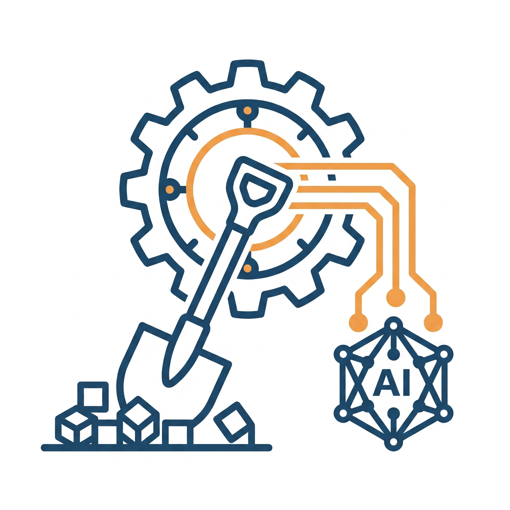

# Logo 设计

> 父：[整体产品 PRD](./ai-data-loop-infra-prd.md) · [UI / UX 设计](./ui-ux-design.md)
>
> 本文记录 `AI Native Data Engine` 视觉标识的设计意图、构图原则与使用规范。

---

## 一、视觉

文件位置：[`apps/web/public/logo.png`](../../apps/web/public/logo.png) · [`apps/web/public/favicon.ico`](../../apps/web/public/favicon.ico)

---

## 二、表达的故事

logo 用三个动作讲完整个产品的核心叙事：

| 动作 | 视觉元素 | 业务隐喻 |
|---|---|---|
| **铲起** | 左下方的铲子正铲入散落的数据块 | 从原始 raw data 中"挖出"有价值的 clip / 样本 |
| **提纯** | 中上的飞轮（齿轮）持续转动 | 通过 mining / tagging / labeling / checking 的闭环不断提纯 |
| **注入** | 右下流水线汇入"AI"节点 | 高质量数据通过 release pipeline 注入 AI 训练 |

一句话：**这个平台是 AI 模型背后的"铲子"与"飞轮"**——把杂乱的物理世界数据，铲起、提纯，再源源不断地输送给模型。

---

## 三、设计原则

### 3.1 三角构图，重心平衡

视觉锚点构成左下 → 中上 → 右下的等腰三角：

- **左下（铲子 + 数据块）**——"原料入口"，重力感最强
- **中上（飞轮）**——"加工中枢"，居中拉起视线
- **右下（流水线 + AI 节点）**——"产出出口"，与左下对称呼应

读者视线天然沿 ↗↘ 走完一遍数据闭环，无需任何文字辅助。

### 3.2 配色：冷蓝主调 + 暖橙点缀

| 色 | 用途 | RGB |
|---|---|---|
| **冷蓝**（主） | 铲子、飞轮、数据块、AI 节点骨架 | 深蓝 `#2C4A6E` |
| **暖橙**（点缀） | 飞轮高亮 + 流水线 + AI 节点连接点 | 橙 `#F0973C` |

冷蓝传达"严谨、可信、基础设施"的科技感；暖橙只用在"流动 / 通电 / 加工中"的关键动线上，让闭环活起来。

### 3.3 纯白无边框背景

- 无外框、无渐变、无阴影
- 适配深浅两种 UI 主题
- 在文档、PPT、徽标墙等任何位置都能直接嵌入

### 3.4 线性扁平风格

- 统一描边粗细，无填充
- 图标语义级抽象（铲子 / 齿轮 / 流水线 / 神经网络节点都是行业通识符号）
- 缩到 16×16 的 favicon 仍可辨识主形

---

## 四、使用规范

| 场景 | 资产 | 备注 |
|---|---|---|
| Web 浏览器 tab 图标 | [`apps/web/public/favicon.ico`](../../apps/web/public/favicon.ico) | 已通过 `index.html` `<link rel="icon">` 挂载 |
| iOS 添加到主屏 | [`apps/web/public/logo.png`](../../apps/web/public/logo.png) | 通过 `apple-touch-icon` 挂载 |
| 文档 / PRD 头图 | `logo.png` 直引 | 控制宽度 ≤ 240px |
| 演示文稿封面 | `logo.png` 居中 | 周围至少留 0.5× logo 宽度 safe area |
| 徽标墙 / 合作图 | 仅 `logo.png` | 不允许添加文字 / 描边 / 阴影 |

### 不允许的改动

- 改色（包括暗色反相）
- 拆分元素单独使用（铲子 / 飞轮 / AI 节点不可独立成 icon）
- 拉伸变形（仅允许等比缩放）
- 在 logo 上叠任何文字或徽章

---

## 五、与产品定位的呼应

- 我们不是 BI、不是标注工具、不是单一应用——是 **AI 数据闭环的基础设施**。
- 铲子与飞轮的视觉直接传达"我们做的是 AI 上游"——上游的数据质量决定模型的天花板。
- 当一名工程师第一次看到这张图时，"挖、提纯、注入 AI"的故事应当不需要任何文字解释就能成立。

---

## 六、参考

- [整体产品 PRD](./ai-data-loop-infra-prd.md)
- [UI / UX 设计](./ui-ux-design.md)
