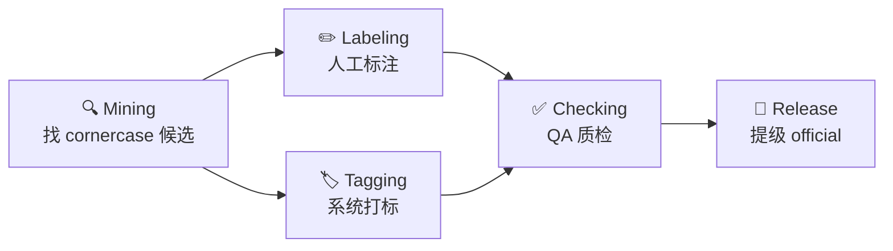

# 模块 PRD · Operations（5 子域人机协同）

> 父文档：[整体产品 PRD](./ai-data-loop-infra-prd.md)
> 路由：`/ops` · `/ops/{mining|labeling|tagging|checking|release}` · `/ops/exports`

## 1. 模块定位

Operations 是**人机协同的执行协调层**——把 OperationsTask（协调单元）拆成 OpsItem（执行项），分发到 5 个子域处理：Mining 找候选、Labeling 标注、Tagging 打标、Checking 质检、Release 发版。

> 简单记忆：**Requirement 给目标，Operations 决定"谁做什么"，PipelineRun 是机器执行的产物**。

## 2. 5 个子域

| 子域 | 输入 | 输出 |
|---|---|---|
| **Mining** | scene_tags / 模型 disagreement / disengagement | OpsItem(clip_ids, payload.cornercase) |
| **Labeling** | 候选 clip | OpsItem(status: pending → in_progress → review → done) + da_tags |
| **Tagging** | 候选 clip | OpsItem(status: pending → applied) + tags |
| **Checking** | labeling/tagging 产出 | OpsItem(status: pending → passed/waived/failed) |
| **Release** | customized dataset_id | OpsItem(status: drafted → gated → approved → **published**) → 触发 promote-to-official |

## 3. 用户故事

| 角色 | 场景 | 主操作 |
|---|---|---|
| Mining 团队 | 把上周路测的 disengagement 数据导出为候选集 | 在 Mining 创建 ops_item，clip_ids 灌一批，加 `hard_case_v1` tag |
| 标注主管 | 派一批 clip 给标注供应商 | Labeling 创建 ops_item，kind=human / auto / hybrid |
| QA | 抽检标注质量 | Checking 列表，按 status 过滤 in_progress |
| Release 工程师 | 把通过质检的 customized 数据集发版 | Release 行级 Promote 按钮 → Modal 选 official 名 → 提交 |

## 4. 主要功能

### 4.1 OpsItem 通用列表（OpsModuleListPage）

- 链路过滤：requirement_id / data_task_id / x_trace_id / scenario / dataset_id / 关键字
- 状态过滤：每模块独立 vocab（`status_options` API 返回）
- 字段：id · title · kind · status · scope（req/dt/trace/scenario/dataset/clips tags）· owner · updated
- 行内：Edit · Delete · 状态快速切换

### 4.2 Dataset Picker（替换自由文本 dataset_id）

- 表单的 `Dataset` 字段是 `<DatasetPicker>` 组件——下拉选已有 + 一键 New
- Release 模块自动 `filterType='customized'`，避免误选 official

### 4.3 Release Promote 入口

- 行级「Promote」按钮：仅 `status=approved` 且 `dataset_id` 非空时可用
- Modal：拉源 dataset → 预填 official 名（`<src.name>_official`）/ tag_expr / allow_train
- 提交后台 `POST /api/datasets/:id/promote`：复制 sample + 写 LineageEvent(release) + OpsItem 状态推到 published
- 失败时 not_found 提示带跳 Catalog 创建 CTA，避免死循环

### 4.4 Snowflake 维度查询

- 4 个 sub-page：Tagging / Labeling / Checking / Mining
- 数据来自 `GET /api/v1/events/dimensions/{dim}` —— 同一 LineageEvent 中心 + EventResult 维度

### 4.5 Exports 页（`/ops/exports`）

- 历史导出 artifact 列表（来自 metadata adapter `export_jobs` 表）
- 字段：dataset_id · format · status · output_path

## 5. 与其他模块的关系

| 上游 | 描述 |
|---|---|
| Requirement | 通过 `requirement_id` 反向关联 |
| Explorer Save Cut | flexible_cut 写一条 LineageEvent + OpsItem (mining/labeling) 可选 |

| 下游 | 描述 |
|---|---|
| Catalog official Dataset | Release Promote 是唯一合法入口 |
| Pipelines | `OperationsTask.id` → `PipelineRun.operations_task_id` |

## 6. 关键设计决策

- **OpsItem 单表 + module 列**：5 子域共享 `ops_items` 表，避免 5 张高相似表。`status` / `kind` 是字符串（开放词表），不强枚举。
- **冗余字段** `requirement_id / data_task_id / x_trace_id` 在 OpsItem 上同时存在——支持任意层级过滤无需 join。
- **Release Promote 是不可逆的 customized → official**：通过 `(dataset_id, clip_id, ts)` 唯一约束保证幂等；改 customized 不会同步到 official。
- **Snowflake 4 维度仅是 query view**：通过 `(event_type, payload_type)` 联合 filter，不开独立物理表。

## 7. 待办与扩展

- [ ] Mining 工作流接 disengagement / shadow mode 自动入仓
- [ ] Labeling 多供应商配置 + 状态回流
- [ ] Checking 规则配置化（拖拽编辑 gate 条件）
- [ ] Release 多人审批流（gated → approved 多签）
- [ ] OpsItem batch 操作（批量改状态 / 派人）
