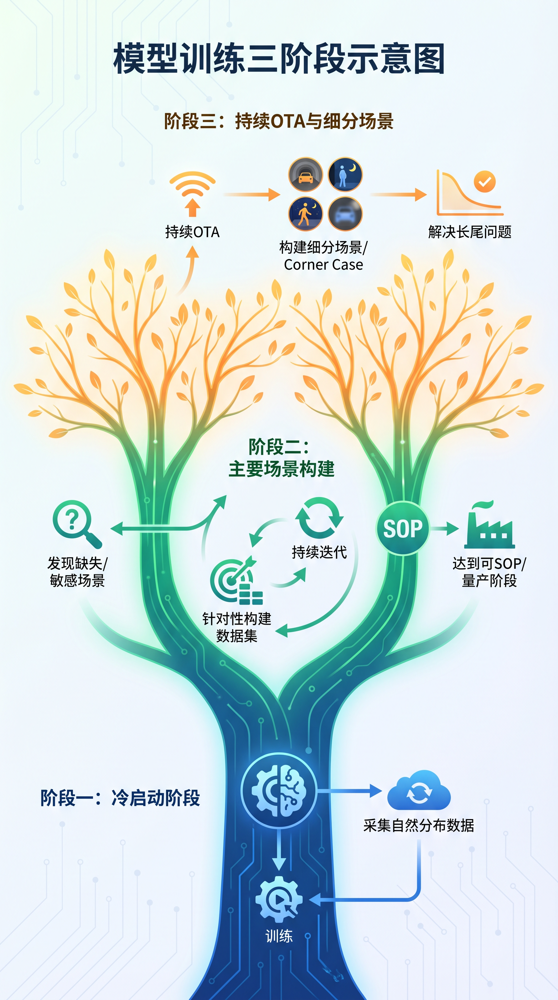

# 数据闭环需求管理系统 PRD

> 本文档描述数据闭环需求管理模块的领域模型、页面流程、API 契约与三层架构设计。

## 1. 背景与目标

自动驾驶数据闭环的核心流程是：**需求定义 → 数据采集 → 数据标注 → 仿真重建 → 流水线运行 → 签收交付**。本模块为这一流程提供端到端的管理能力，覆盖需求拆解为数据任务、任务执行跟踪、以及质量签收闭环。

在当前 workbench 中，需求管理模块还承担跨页面编排职责：

- 从 Requirement 直接跳转到 Explorer/Search（携带 requirement、tags、query）
- 从 Search 结果继续下钻到 Clip Detail 完成样本核验
- 从 Clip Detail 上卷回 Requirement 或 Catalog 数据集分组

下图展示了模型训练从冷启动、主要场景构建，到持续 OTA 与 Corner Case 闭环的三阶段演进。需求管理系统的价值，正是在这个演进过程中，把“发现缺失场景”“针对性构建数据集”“持续迭代与签收交付”沉淀为可跟踪、可分派、可验收的标准化流程。



从产品视角看，阶段一更强调自然分布数据采集与初始训练，阶段二开始围绕主场景和敏感场景进行针对性数据建设，阶段三则要求持续 OTA、构建细分场景与 Corner Case，并最终解决长尾问题。数据闭环需求管理模块需要支撑的，正是阶段二和阶段三中最核心的协同动作：需求提出、任务拆解、执行跟踪、质量签收和结果回流。

### 1.1 核心用户故事

| 角色         | 用户故事                                                                 |
| ------------ | ------------------------------------------------------------------------ |
| 算法工程师   | 提交数据需求，描述所需场景和优先级，跟踪需求进度                         |
| 数据工程师   | 查看待处理的数据任务，执行采集/标注/重建，更新任务状态                   |
| 数据分析师 DA | 按需求上下文检索 clip，验证场景覆盖并沉淀分析结论                         |
| 项目负责人   | 查看需求整体看板，按状态/优先级筛选，审核签收数据任务                     |
| 平台运维     | 查看流水线运行状态，关联需求与流水线执行记录                             |

## 2. 领域模型（更新）

Requirement 是目标对象；DataTask、OperationsTask、PipelineRun 是三个不同执行层级。

```
Requirement (要达成什么)
├── id, title, description, source, priority, status
├── scene_tags[], vehicle_tags[], created_at, updated_at
│
└── DataTask[] (要建设哪些数据)
  ├── id, requirement_id, task_type, title, status, assignee
  ├── sign_off_status, sign_off_by, sign_off_at
  │
  └── OperationsTask[] (如何执行与协同)
    ├── id, requirement_id, data_task_id
    ├── kind, status, owner, scenario, dataset_id, clip_ids[]
    │
    └── PipelineRun[] (系统实际运行记录)
      ├── run_id, requirement_id, operation_task_id
      ├── stage, job_name, status
      └── started_at, finished_at, estimated_cost
```

关系约束：

- Requirement 1:N DataTask
- DataTask 1:N OperationsTask
- OperationsTask 1:N PipelineRun
- PipelineRun 是执行事实，不等于任务对象

### 2.1 状态机（更新）

**Requirement Status**: `draft` → `approved` → `in_progress` → `completed` / `cancelled`

**DataTask Status**: `pending` → `in_progress` → `done` / `failed`

**OperationsTask Status**: `todo` → `doing` → `done` / `blocked`

**PipelineRun Status**: `queued` → `running` → `success` / `failed` / `cancelled`

**SignOff Status**: `pending` → `approved` / `rejected`

### 2.2 概念澄清：为什么一个 Requirement 需要多个 DataTasks

一个 Requirement 对应多个 DataTasks 是常态，原因如下：

- 场景拆分：同一需求通常包含多个子场景，需要独立建设与验收。
- 模态拆分：camera / lidar / can 等链路质量与处理方式不同。
- 生命周期拆分：冷启动补数、失败回流、回归验证是不同阶段。
- 协作拆分：不同角色需要独立 owner、SLA、状态。
- 优先级与成本拆分：可按 ROI 分批推进，避免大任务阻塞。
- 审计拆分：便于追溯 Requirement -> Task -> Run -> Result 证据链。

一句话：Requirement 定义目标，DataTask 定义数据建设单元，OperationsTask 定义执行协同单元，PipelineRun 定义系统执行事实。

### 2.3 追踪键规范（`x_trace_id` 全链路）

为统一 Requirement → DataTask → OperationsTask → PipelineRun 四层的链路追踪，平台约定：

| 键名 | 归属 | 含义 |
| --- | --- | --- |
| `x_trace_id` | **所有四层对象冗余共享** | 跨系统全链路主追踪键（与 HTTP 头 `X-Trace-Id` 同名，便于跨服务传播） |
| `requirement_id` | Requirement | 主键；对外契约的业务标识 |
| `data_task_id` | DataTask | 主键 |
| `operations_task_id` | OperationsTask | 主键 |
| `pipeline_run_id` | PipelineRun | 主键 |
| `trace_parent_id` | PipelineRun | 父 run / 父 span 标识，支持回放、修复因果链 |
| `correlation_id` | 可选 | 外部系统已有 traceId 时的对接字段 |

传播通道：

- HTTP：请求头 `X-Trace-Id`（由 API 注入到 Session/日志上下文）。
- 日志：结构化字段 `x_trace_id`（所有服务统一）。
- 任务参数：Dagster / Celery 的 op_config / task kwargs 里透传 `x_trace_id`。
- Kafka / 外部事件流：header `x-trace-id`。
- 外部采集 / 标注方：交付物元数据必须携带 `x_trace_id` + `requirement_id`。

说明：此前草案曾使用 `loop_trace_id`，已统一改为 `x_trace_id`（更短、更通用、与 HTTP 头约定一致）。

详见 ADR：`docs/adr/adr-pipelinerun-unified-fact-model.md`。

## 3. 三层架构设计

### 3.1 API 层 (FastAPI)

负责领域逻辑与持久化，提供 RESTful 资源语义。

| Method | Path                                     | 说明             |
| ------ | ---------------------------------------- | ---------------- |
| POST   | /requirements                            | 创建需求         |
| GET    | /requirements                            | 需求列表(分页)   |
| GET    | /requirements/:id                        | 需求详情         |
| PATCH  | /requirements/:id                        | 更新需求         |
| GET    | /requirements/stats                      | 需求统计         |
| POST   | /requirements/:id/tasks                  | 创建数据任务     |
| GET    | /requirements/:id/tasks                  | 任务列表         |
| PATCH  | /data-tasks/:id                          | 更新任务         |
| POST   | /data-tasks/:id/sign-off                 | 签收任务         |
| GET    | /data-tasks/:id/collection-jobs          | 采集作业列表     |
| GET    | /data-tasks/:id/annotation-tasks         | 标注任务列表     |
| GET    | /data-tasks/:id/pipeline-runs            | 流水线运行列表   |

### 3.2 BFF 层 (Koa.js)

负责 ViewModel 聚合、分页/筛选/排序、以及对上游 API 的代理调用。

| BFF Path                     | 说明                                         |
| ---------------------------- | -------------------------------------------- |
| GET /api/requirements        | 需求列表 ViewModel (含统计卡片)              |
| GET /api/requirements/:id    | 需求详情 ViewModel (含任务列表、签收状态)    |
| GET /api/requirements/stats  | 需求统计聚合                                 |
| GET /api/ops/tasks           | Operations Task 列表（支持 requirement_id、data_task_id 过滤） |
| GET /api/pipelines/runs      | Pipeline Run 列表（支持 requirement_id、operation_task_id 过滤） |
| GET /api/clips               | Clip 列表（供 requirement drilldown 过滤）   |
| GET /api/clips/:clipId       | Clip 详情（供 requirement 验收跳转）         |
| POST /api/requirements       | 创建需求 (透传)                              |
| PATCH /api/requirements/:id  | 更新需求 (透传)                              |
| POST /api/requirements/:id/tasks  | 创建数据任务 (透传)                     |
| PATCH /api/data-tasks/:id    | 更新数据任务 (透传)                          |
| POST /api/data-tasks/:id/sign-off | 签收数据任务 (透传)                    |

### 3.3 Web 层 (React)

| 路由                        | 页面             | 说明                                   |
| --------------------------- | ---------------- | -------------------------------------- |
| /requirements               | RequirementList  | 需求列表 + 筛选 + 统计卡片            |
| /requirements/:id           | RequirementDetail| 需求详情 + 数据任务列表 + 签收操作     |
| /explorer/search            | SearchPage       | 从 requirement 预置参数进行 clip 检索 |
| /explorer/clips/:clipId     | ClipDetailPage   | 查看 clip 明细并上卷回 requirement    |

## 4. ViewModel 设计

### 4.1 RequirementListItem

```typescript
type RequirementListItem = {
  id: string
  title: string
  source: string
  priority: string
  status: string
  scene_tags: string[]
  task_count: number
  created_at: string
}
```

### 4.2 RequirementDetailView

```typescript
type RequirementDetailView = {
  id: string
  title: string
  description: string
  source: string
  priority: string
  status: string
  scene_tags: string[]
  vehicle_tags: string[]
  created_at: string
  updated_at: string
  data_tasks: DataTaskView[]
  operations_tasks?: OperationsTaskView[]
  pipeline_runs?: PipelineRunView[]
  explorer_context?: {
    requirement_id: string
    tags: string[]
    query: string
  }
}

type DataTaskView = {
  id: string
  task_type: string
  title: string
  status: string
  assignee: string | null
  sign_off_status: string
  sign_off_by: string | null
  sign_off_at: string | null
}

type OperationsTaskView = {
  id: string
  data_task_id?: string | null
  kind: string
  status: string
  owner?: string | null
  scenario?: string | null
  dataset_id?: string | null
}

type PipelineRunView = {
  run_id: string
  operation_task_id?: string | null
  stage?: string | null
  job_name: string
  status: string
  started_at?: string | null
  finished_at?: string | null
  estimated_cost?: number | null
}
```

### 4.3 RequirementStats

```typescript
type RequirementStats = {
  total: number
  by_status: Record<string, number>
  by_priority: Record<string, number>
}
```

## 5. 页面交互设计

### 5.1 需求列表页

- **统计卡片区**：总数、各状态分布、各优先级分布
- **筛选栏**：状态下拉、优先级下拉、关键词搜索
- **列表表格**：ID、标题、来源、优先级（带颜色标签）、状态（StatusBadge）、任务数、创建时间
- **行点击**：导航到详情页
- **Find clips 按钮**：跳转 `/explorer/search`，带 `requirement`、`tags`、`q` 参数

### 5.2 需求详情页

- **面包屑**：需求列表 > 需求详情
- **需求信息卡**：标题、描述、来源、优先级、状态、场景标签、车型标签
- **数据任务列表**：表格展示任务，含签收状态 Badge
- **签收操作**：对 `pending` 签收状态的任务显示「通过」「驳回」按钮
- **Search matching clips 按钮**：跳转 `/explorer/search`，预置 `scene_tags` 与 `target_scene`

## 6. 跨页面下钻与上卷

### 6.1 下钻链路

```text
Requirement List/Detail
-> Explorer Search (预置 requirement + tags + query)
-> Clip result
-> Clip Detail
```

### 6.2 上卷链路

```text
Clip Detail
-> Back to requirement (若 URL 含 requirement)
-> Back to dataset (若 URL 含 dataset)
-> Back to clips (默认)
```

### 6.3 URL 上下文约定

- `requirement`: requirement id
- `dataset`: dataset id（场景聚合 bucket）
- `q`: 自然语言查询文本（语义检索占位）
- `tags`: 标签列表（`,` 分隔）
