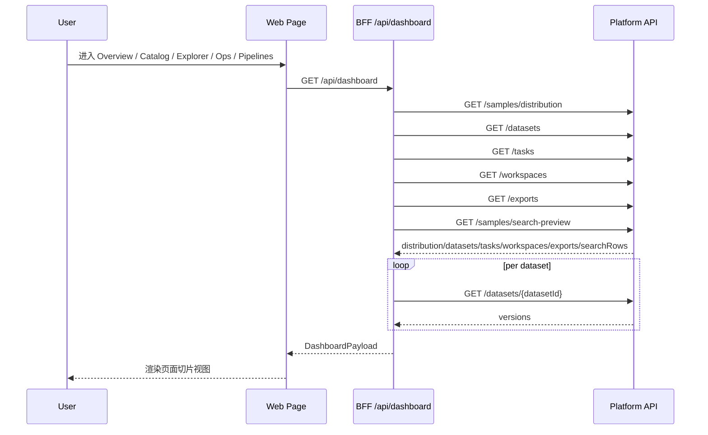
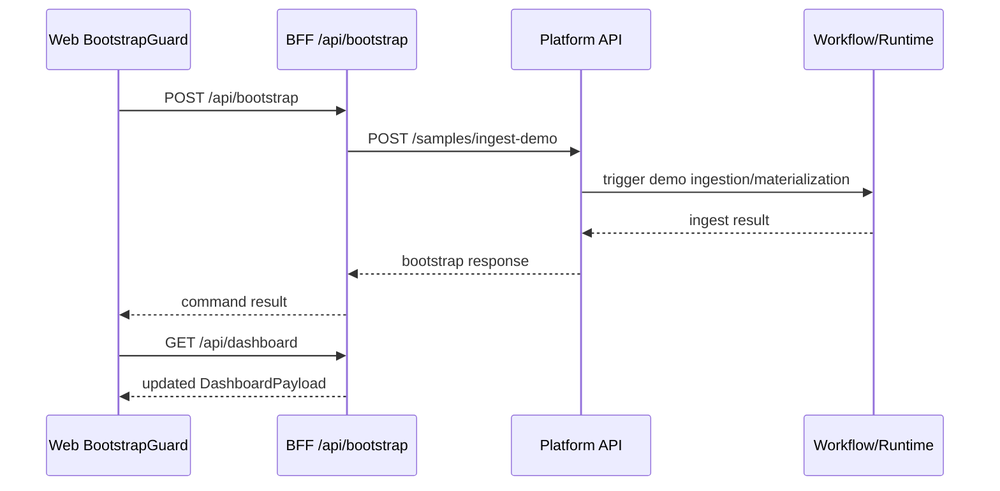
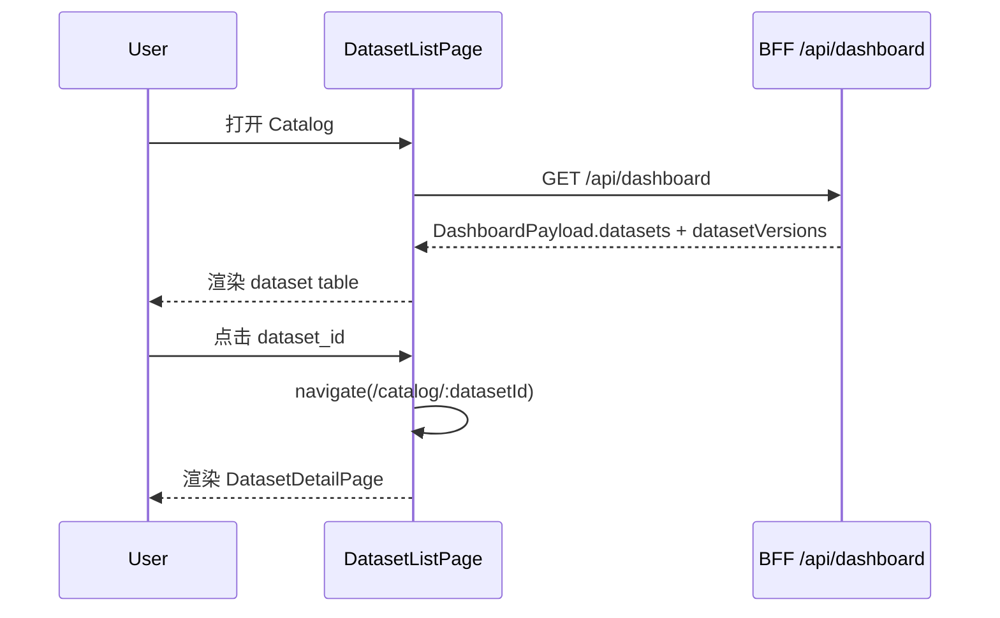
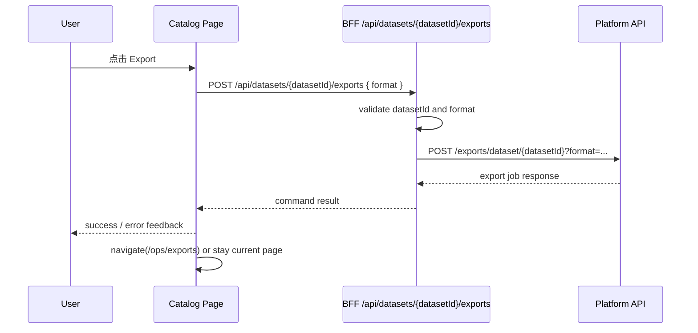
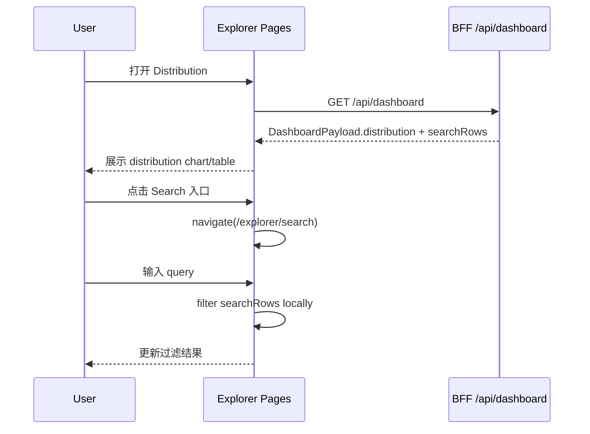
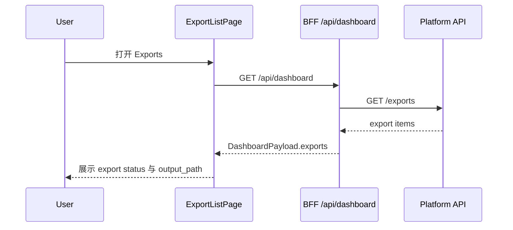

# 界面 Item 设计、页面流转与平台交互细节

## 目的

这份文档用于补齐 `ai-data-loop-engine` 在**体验访问层（Experience Access Layer）**的设计说明，回答三个问题：

1. 当前 workbench 的界面 item 应如何分层理解
2. 页面之间如何流转，用户在每一步看到什么、能做什么
3. Web、BFF、Platform API 之间的交互边界与数据责任如何划分

这份文档不做视觉稿或高保真交互稿，而是从系统设计层定义当前 MVP 的：

- workbench 信息架构
- 页面 item 类型与职责
- 页面流转
- 平台交互路径
- 当前实现的简化点与边界

## 与 PRD 和总体架构的关系

这份文档建立在以下设计之上：

- [AI Data Loop Infra PRD](../prd/ai-data-loop-infra-prd.md)
  - 定义统一工作台、统一任务与资产入口、Core Platform Layer / Domain Solution Layer 边界
- [总体架构说明](../architecture/overview.md)
  - 定义 `Web -> BFF -> Platform API -> RuntimeContainer / adapters` 的主链路
- [API 概览](../api/overview.md)
  - 区分 Experience Access API（BFF）与 Platform API（FastAPI）
- [首版 MVP 范围](../architecture/mvp-scope.md)
  - 说明当前 workbench 是刻意收敛后的 MVP，而不是完整企业级工作流平台

因此，这份文档聚焦的是：

- **体验访问层如何把平台能力组织成可理解、可操作的页面与交互**

而不是：

- 重新定义平台资源语义
- 重新定义 workflow / adapter / profile 的底层边界

## 当前体验访问层总体边界

当前推荐的访问路径是：

```text
User
-> Web Workbench
-> BFF (Experience Access API)
-> Platform API
-> workflows / services / runtime container
-> adapters / storage / query / metadata / search
```

其中：

- **Web** 负责页面渲染、路由切换、轻量本地状态和交互反馈
- **BFF** 负责页面级聚合、浏览器友好的 app-facing payload、最小命令转发
- **Platform API** 负责平台资源语义和 control-plane 入口
- **workflows / services** 负责执行具体业务流程与异步动作
- **runtime container / adapters** 负责环境装配与底层实现

这里的关键原则是：

- BFF 可以组织页面 ViewModel，但不拥有平台事实
- Platform API 拥有资源语义，但不直接负责页面聚合模型
- Web 消费的是 app-facing payload，而不是底层 provider 细节

## Workbench 信息架构

当前 Web workbench 按 5 个模块组织：

1. **Overview**
2. **Catalog**
3. **Explorer**
4. **Operations**
5. **Pipelines**

这些模块由 [apps/web/src/shared/layouts/nav-config.ts](../../apps/web/src/shared/layouts/nav-config.ts) 统一定义，并由 [apps/web/src/routes.tsx](../../apps/web/src/routes.tsx) 注册到路由系统中。

### 模块级导航结构

workbench 采用三层导航组织：

1. **Header**
   - 展示当前模块标签
   - 提供折叠、全屏等全局动作
2. **Micro Menu**
   - 展示五个一级模块入口
   - 用于模块级切换
3. **Sidebar**
   - 展示当前模块下的子页面入口
   - 用于页面级导航

这意味着用户体验不是“单页仪表盘”，而是一个最小工作台：

```text
模块选择
-> 模块子页面选择
-> 页面内动作
```

### 当前路由映射

| 路径 | 模块 | 页面 | 说明 |
| --- | --- | --- | --- |
| `/` | Overview | OverviewPage | 平台总览首页 |
| `/catalog` | Catalog | DatasetListPage | 数据集列表 |
| `/catalog/:datasetId` | Catalog | DatasetDetailPage | 数据集详情与版本 |
| `/explorer` | Explorer | DistributionPage | 数据分布总览 |
| `/explorer/search` | Explorer | SearchPage | 样本搜索预览 |
| `/ops` | Operations | TaskBoardPage | 任务看板 |
| `/ops/exports` | Operations | ExportListPage | 导出记录 |
| `/pipelines` | Pipelines | RunHistoryPage | 流水线运行历史 |

## 界面 Item 设计

这里的“item 设计”指的是页面中的核心交互与展示单元，而不是视觉样式细节。

### 1. 模块导航 Item

#### 1.1 Micro Menu Item

用于一级模块切换。

包含：

- 模块名称
- 图标
- 当前激活态
- 点击后跳转到该模块的第一个页面

当前模块包括：

- Overview
- Catalog
- Explorer
- Operations
- Pipelines

#### 1.2 Sidebar Nav Item

用于模块内子页面切换。

包含：

- 子页面名称
- 目标路径
- 当前选中态

例如：

- Explorer 下有 `Distribution` 和 `Search`
- Operations 下有 `Tasks` 和 `Exports`

### 2. 页面容器 Item

#### 2.1 Page Container

页面统一使用 page container 模式承载：

- 页面标题
- 页面描述
- 页面级 actions 区域
- 页面主体内容

这种模式由 [apps/web/src/shared/components/page-container.tsx](../../apps/web/src/shared/components/page-container.tsx) 抽象，适合作为后续所有工作台页面的统一结构。

### 3. 数据展示 Item

#### 3.1 Stat Card

用于 Overview 页的汇总指标展示。

典型展示项：

- datasets 数量
- tasks 数量
- samples 数量
- exports 数量

设计原则：

- 用于快速感知平台状态
- 不承载复杂解释逻辑
- 应作为“入口摘要”，不是详细分析页

#### 3.2 Data Table

当前 MVP 最主要的数据展示 item。

适用于：

- dataset 列表
- dataset version 列表
- task 列表
- export 列表
- search rows 列表
- run history 列表

典型列包括：

- 标识列（id / name）
- 状态列
- 类型列
- 归属列
- 动作列

设计原则：

- 列结构稳定
- 支持定制 cell renderer
- 支持从列表进入详情页或执行命令
- 作为 MVP 阶段的核心 list/detail UI 模式

#### 3.3 Status Badge

用于统一展示任务、导出、运行状态。

当前状态集合为：

- `pending`
- `running`
- `done`
- `failed`
- `canceled`

设计原则：

- 状态语义统一
- 不在页面内重复发明状态枚举
- 后续页面应尽量复用同一状态可视化模式

#### 3.4 Recent Activity Item

用于 Overview 页展示近期任务和导出活动。

作用：

- 给用户提供平台最近动作的摘要
- 帮助用户快速决定下一步跳转方向

#### 3.5 Quick Action Item

用于 Overview 页提供高频入口。

当前应视为：

- 页面跳转捷径
- 而不是重型流程触发器

适合放置：

- 浏览数据集
- 查看分布
- 搜索样本
- 查看导出

### 4. 命令型 Item

#### 4.1 Bootstrap Action

职责：

- 初始化 demo 数据环境
- 触发最小 ingestion/materialization 主链路

当前特征：

- 通过 `POST /api/bootstrap` 触发
- 在应用加载时 best-effort 执行
- 更像“环境引导动作”，不是长期保留的业务主操作

#### 4.2 Export Action

职责：

- 从 dataset list 或 dataset detail 发起导出
- 通过 BFF 转发到 Platform API
- 将结果沉淀到 exports 视图

当前特征：

- 支持 `parquet / csv / jsonl`
- 当前是最明确的用户主动命令之一

### 5. 状态反馈 Item

所有页面都应具备最小反馈 item：

- loading state
- empty state
- error state
- action completed state

当前 MVP 的实现还较轻，但在文档层应提前将其定义为体验访问层的标准组成。

## 字段级 Item 设计表

本节将“页面 item”进一步下钻到字段级，定义页面渲染时最小可见字段、交互属性和来源边界。

字段设计遵循三条原则：

1. **字段尽量直接映射当前 `DashboardPayload` 或命令响应**
2. **页面只消费 app-facing 字段，不暴露底层 provider 细节**
3. **MVP 阶段允许部分字段为派生字段，但必须明确派生规则**

### 1. 全局导航与容器字段

#### 1.1 Header Item 字段表

| 字段 | 类型 | 来源 | 必填 | 说明 |
| --- | --- | --- | --- | --- |
| `currentMenuLabel` | string | 当前激活 nav group | 是 | 当前模块标题 |
| `collapseMicroApp` | boolean | Web local state / localStorage | 是 | 一级模块栏是否折叠 |
| `collapseMenu` | boolean | Web local state / localStorage | 是 | sidebar 是否折叠 |
| `fullscreen` | boolean | Web local state | 是 | 是否全屏 |
| `onToggleMicroApp` | action | Web interaction | 是 | 切换 micro menu |
| `onToggleMenu` | action | Web interaction | 是 | 切换 sidebar |
| `onToggleFullscreen` | action | Web interaction | 是 | 切换全屏 |

#### 1.2 Micro Menu Item 字段表

| 字段 | 类型 | 来源 | 必填 | 说明 |
| --- | --- | --- | --- | --- |
| `label` | string | `navGroups[].label` | 是 | 模块名 |
| `icon` | string | `navGroups[].icon` | 是 | 模块图标 |
| `active` | boolean | 当前路由匹配 | 是 | 是否激活 |
| `targetPath` | string | `navGroups[].items[0].path` | 是 | 进入模块默认页 |

#### 1.3 Sidebar Nav Item 字段表

| 字段 | 类型 | 来源 | 必填 | 说明 |
| --- | --- | --- | --- | --- |
| `label` | string | `navGroups[].items[].label` | 是 | 子页面名称 |
| `path` | string | `navGroups[].items[].path` | 是 | 路由路径 |
| `active` | boolean | 当前路由匹配 | 是 | 是否选中 |

#### 1.4 Page Container 字段表

| 字段 | 类型 | 来源 | 必填 | 说明 |
| --- | --- | --- | --- | --- |
| `title` | string | 页面定义 | 是 | 页面标题 |
| `description` | string | 页面定义 | 否 | 页面说明 |
| `actions` | ReactNode | 页面定义 | 否 | 页面级操作区 |
| `children` | ReactNode | 页面定义 | 是 | 主体内容 |

### 2. Overview 页面字段级 Item

#### 2.1 PlatformStats 字段表

| 展示字段 | 类型 | 来源 | 派生规则 | 说明 |
| --- | --- | --- | --- | --- |
| `datasetCount` | number | `datasets.length` | 直接计数 | 数据集总数 |
| `taskCount` | number | `tasks.length` | 直接计数 | 任务总数 |
| `sampleCount` | number | `distribution[].sample_count` | 聚合求和 | 样本总量近似值 |
| `exportCount` | number | `exports.length` | 直接计数 | 导出记录数 |

#### 2.2 QuickActions 字段表

| 字段 | 类型 | 来源 | 必填 | 说明 |
| --- | --- | --- | --- | --- |
| `label` | string | 页面定义 | 是 | 动作名称 |
| `description` | string | 页面定义 | 否 | 动作说明 |
| `targetPath` | string | 页面定义 | 是 | 跳转路由 |
| `disabled` | boolean | Web local rule | 是 | 是否禁用 |

推荐动作集合：

- `Browse Datasets` -> `/catalog`
- `View Distribution` -> `/explorer`
- `Search Samples` -> `/explorer/search`
- `View Exports` -> `/ops/exports`

#### 2.3 RecentActivity 字段表

| 字段 | 类型 | 来源 | 派生规则 | 说明 |
| --- | --- | --- | --- | --- |
| `type` | `'task' | 'export'` | `tasks` / `exports` | 合并列表 | 活动类型 |
| `id` | string | `task_id` / `export_id` | 直接映射 | 活动主键 |
| `title` | string | `title` / `dataset_id` | 直接映射/派生 | 活动标题 |
| `status` | string | `status` | 直接映射 | 活动状态 |
| `targetPath` | string | 页面规则 | 由 type 派生 | 跳转目标 |

### 3. Catalog 页面字段级 Item

#### 3.1 Dataset Table 字段表

| 列字段 | 类型 | 来源 | 交互 | 说明 |
| --- | --- | --- | --- | --- |
| `dataset_id` | string | `datasets[].dataset_id` | 可点击 | 数据集唯一标识，进入详情 |
| `name` | string | `datasets[].name` | 只读 | 数据集名称 |
| `workspace_id` | string | `datasets[].workspace_id` | 只读 | 所属 workspace |
| `profile` | string | `datasets[].profile` | 只读 | profile 名称 |
| `exportAction` | action | 页面命令 | 点击触发 | 发起 export |

#### 3.2 Dataset Detail Summary 字段表

| 字段 | 类型 | 来源 | 说明 |
| --- | --- | --- | --- |
| `dataset_id` | string | 路由参数 + `datasets` | 当前 dataset 主键 |
| `name` | string | `datasets[].name` | 数据集名称 |
| `workspace_id` | string | `datasets[].workspace_id` | workspace 归属 |
| `profile` | string | `datasets[].profile` | 运行 profile |
| `versionCount` | number | `datasetVersions[datasetId].length` | 版本数量 |

#### 3.3 Dataset Versions Table 字段表

| 列字段 | 类型 | 来源 | 说明 |
| --- | --- | --- | --- |
| `version_id` | string | `datasetVersions[datasetId][].version_id` | 版本标识 |
| `dataset_id` | string | `datasetVersions[datasetId][].dataset_id` | 所属 dataset |
| `sample_count` | number | `datasetVersions[datasetId][].sample_count` | 样本数 |
| `table_name` | string | `datasetVersions[datasetId][].table_name` | 查询表名 |

#### 3.4 Export Command 字段表

| 字段 | 类型 | 来源 | 必填 | 说明 |
| --- | --- | --- | --- | --- |
| `datasetId` | string | 当前 dataset / 当前行 | 是 | 导出目标 |
| `format` | `'parquet' | 'csv' | 'jsonl'` | 用户选择 / 默认值 | 否 | 导出格式，默认 `parquet` |
| `submitting` | boolean | Web local state | 是 | 是否提交中 |
| `success` | boolean | BFF 响应 | 否 | 提交是否成功 |
| `errorMessage` | string | BFF 错误响应 | 否 | 错误信息 |

### 4. Explorer 页面字段级 Item

#### 4.1 Distribution Table / Chart 字段表

| 字段 | 类型 | 来源 | 说明 |
| --- | --- | --- | --- |
| `scene` | string | `distribution[].scene` | 分布维度 |
| `sample_count` | number | `distribution[].sample_count` | 场景样本数 |
| `share` | number | 前端派生 | `sample_count / total` 的占比 |

#### 4.2 Search Input 字段表

| 字段 | 类型 | 来源 | 说明 |
| --- | --- | --- | --- |
| `query` | string | Web local state | 用户输入关键词 |
| `placeholder` | string | 页面定义 | 输入提示 |
| `isFiltering` | boolean | Web local state | 是否正在本地过滤 |

#### 4.3 Search Result Table 字段表

| 列字段 | 类型 | 来源 | 说明 |
| --- | --- | --- | --- |
| `id` | string | `searchRows[].id` | 样本标识 |
| `scene` | string | `searchRows[].scene` | 场景标签 |
| `dataset_version_id` | string | `searchRows[].dataset_version_id` | 版本归属，可选 |
| `matched` | boolean | Web local rule | 当前关键词是否命中 |

### 5. Operations 页面字段级 Item

#### 5.1 Task Table 字段表

| 列字段 | 类型 | 来源 | 说明 |
| --- | --- | --- | --- |
| `task_id` | string | `tasks[].task_id` | 任务主键 |
| `title` | string | `tasks[].title` | 任务标题 |
| `status` | string | `tasks[].status` | 任务状态 |
| `task_type` | string | `tasks[].task_type` | 任务类型 |

#### 5.2 Export Table 字段表

| 列字段 | 类型 | 来源 | 说明 |
| --- | --- | --- | --- |
| `export_id` | string | `exports[].export_id` | 导出主键 |
| `dataset_id` | string | `exports[].dataset_id` | 对应 dataset |
| `format` | string | `exports[].format` | 导出格式 |
| `status` | string | `exports[].status` | 导出状态 |
| `output_path` | string | `exports[].output_path` | 输出路径 |

### 6. Pipelines 页面字段级 Item

#### 6.1 Run History Table 字段表

当前实现中 `Pipelines` 页面主要复用 task/run 风格数据，因此字段设计保持最小：

| 列字段 | 类型 | 推荐来源 | 说明 |
| --- | --- | --- | --- |
| `run_id` | string | 当前可由 `task_id` 近似映射 | 运行记录标识 |
| `title` | string | `tasks[].title` | 运行标题 |
| `status` | string | `tasks[].status` | 运行状态 |
| `run_type` | string | `tasks[].task_type` | 运行类型 |

## 页面设计与页面流转

下面按当前模块说明页面设计和核心流转。

### 1. Overview

#### 页面目标

让用户在进入 workbench 后快速回答：

- 当前平台里有什么
- 最近发生了什么
- 我下一步应该去哪里

#### 核心 item

- PlatformStats
- QuickActions
- RecentActivity

#### 数据来源

- BFF `GET /api/dashboard`

#### 页面动作

- 跳转到 Catalog
- 跳转到 Explorer
- 跳转到 Search
- 跳转到 Exports

#### 页面流转

```text
进入系统
-> Overview
-> 查看统计卡片与最近活动
-> 选择进入 Catalog / Explorer / Operations / Pipelines
```

### 2. Catalog

#### 2.1 Dataset List Page

##### 页面目标

让用户查看当前平台中有哪些数据集，并能从列表进入详情或发起导出。

##### 核心 item

- Dataset table
- Export action button
- Dataset id/detail link

##### 数据来源

- 当前通过 `GET /api/dashboard` 聚合 payload 获得 datasets

##### 页面动作

- 查看数据集详情
- 发起导出

##### 页面流转

```text
Overview / Catalog 入口
-> Dataset List
-> 点击 dataset id
-> Dataset Detail
```

或：

```text
Dataset List
-> 点击 Export
-> POST /api/datasets/{datasetId}/exports
-> 导出任务进入 Exports 视图
```

#### 2.2 Dataset Detail Page

##### 页面目标

让用户查看单个 dataset 的基本信息及版本列表。

##### 核心 item

- Dataset metadata summary
- Dataset versions table
- Export action
- Back action

##### 数据来源

- 当前仍然通过 dashboard payload 衍生
- `datasetVersions[datasetId]` 作为当前版本信息来源

##### 页面动作

- 返回列表
- 发起导出

##### 页面流转

```text
Dataset List
-> Dataset Detail
-> 查看版本
-> 发起导出 or 返回列表
```

### 3. Explorer

#### 3.1 Distribution Page

##### 页面目标

让用户从聚合视角理解当前样本分布。

##### 核心 item

- Distribution chart
- Distribution table
- 跳转 Search 的 action

##### 数据来源

- `GET /api/dashboard` 中的 `distribution`

##### 页面动作

- 进入 Search 页面

##### 页面流转

```text
Overview / Explorer 入口
-> Distribution
-> 查看场景分布
-> 跳转 Search
```

#### 3.2 Search Page

##### 页面目标

让用户浏览样本级预览结果，并进行最小检索过滤。

##### 核心 item

- Search input
- Search result table

##### 数据来源

- `GET /api/dashboard` 中的 `searchRows`

##### 当前实现约束

当前 search 是：

- 基于 preview payload 的前端本地过滤

而不是：

- 完整的服务端检索系统
- 通用 query language
- 大规模分页搜索系统

##### 页面流转

```text
Distribution
-> Search
-> 输入关键词
-> 在 preview rows 中本地过滤
```

### 4. Operations

#### 4.1 Task Board Page

##### 页面目标

让用户查看当前任务状态。

##### 核心 item

- task table
- status badge

##### 数据来源

- `GET /api/dashboard` 中的 `tasks`

##### 页面流转

```text
Overview / Operations 入口
-> Task Board
-> 查看任务状态
```

#### 4.2 Export List Page

##### 页面目标

让用户查看导出结果与输出路径。

##### 核心 item

- export table
- status badge
- output path

##### 数据来源

- `GET /api/dashboard` 中的 `exports`

##### 页面流转

```text
Dataset List / Dataset Detail 发起 Export
-> Export List
-> 查看导出状态与输出路径
```

### 5. Pipelines

#### Run History Page

##### 页面目标

让用户查看当前 MVP 中的运行历史视图。

##### 核心 item

- run history table
- status badge

##### 当前实现约束

当前 `Pipelines` 页面仍是 MVP 近似表达：

- 它不是完整独立的 pipeline studio
- 当前主要复用 task / run 风格的数据进行展示

因此文档必须明确：

- 当前页是运行历史视图
- 不是完整的 DAG 编排与运行控制系统

##### 页面流转

```text
Overview / Pipelines 入口
-> Run History
-> 查看运行记录与状态
```

## 页面状态机

本节将页面从“静态页面”进一步抽象为“状态驱动视图”，帮助后续实现 loading / empty / error / command feedback 的一致交互。

状态机统一约定：

- `idle`：页面初始尚未发起数据请求
- `loading`：正在请求 BFF 数据
- `ready`：数据成功加载且可正常渲染
- `empty`：请求成功但无可展示数据
- `error`：请求失败
- `submitting`：页面上的命令型动作提交中
- `success_feedback`：命令成功后的短暂反馈态

### 1. Overview 页面状态机

```text
idle
-> loading
-> ready            (dashboard payload 加载成功且存在至少一种内容)
-> empty            (dashboard payload 成功但关键区块全空)
-> error            (dashboard 请求失败)

ready
-> ready            (模块导航切换后返回)
-> error            (后续刷新失败)
```

### 2. Dataset List 页面状态机

```text
idle
-> loading
-> ready            (datasets 非空)
-> empty            (datasets 为空)
-> error            (dashboard 请求失败)

ready
-> submitting       (点击 Export)
-> ready            (点击 dataset id 进入详情前)

submitting
-> success_feedback (导出创建成功)
-> error            (导出失败)

success_feedback
-> ready            (提示消失或跳转 Exports)
```

### 3. Dataset Detail 页面状态机

```text
idle
-> loading
-> ready            (dataset 命中，版本可渲染)
-> empty            (dataset 不存在或 versions 为空但允许空表)
-> error            (dashboard 请求失败)

ready
-> submitting       (点击 Export)
-> ready            (点击 Back)

submitting
-> success_feedback (导出成功)
-> error            (导出失败)
```

### 4. Distribution 页面状态机

```text
idle
-> loading
-> ready            (distribution 有数据)
-> empty            (distribution 为空)
-> error            (dashboard 请求失败)

ready
-> ready            (切换图表/表格视图)
-> ready            (跳转 Search)
```

### 5. Search 页面状态机

```text
idle
-> loading
-> ready            (searchRows 成功加载)
-> empty            (searchRows 为空)
-> error            (dashboard 请求失败)

ready
-> ready            (输入关键词但结果仍存在)
-> empty            (输入关键词后无匹配)
```

### 6. Task Board 页面状态机

```text
idle
-> loading
-> ready            (tasks 非空)
-> empty            (tasks 为空)
-> error            (dashboard 请求失败)
```

### 7. Export List 页面状态机

```text
idle
-> loading
-> ready            (exports 非空)
-> empty            (exports 为空)
-> error            (dashboard 请求失败)

ready
-> ready            (导出状态刷新)
```

### 8. Run History 页面状态机

```text
idle
-> loading
-> ready            (runs/tasks 可展示)
-> empty            (无运行记录)
-> error            (dashboard 请求失败)
```

## BFF ViewModel 设计稿

当前 BFF 已提供统一聚合模型 `DashboardPayload`，定义于 [apps/bff/src/services/dashboard.ts](../../apps/bff/src/services/dashboard.ts)。从页面设计角度，建议将它视为 **WorkbenchShellViewModel + 各页面切片 ViewModel 的源模型**。

### 1. 当前聚合模型

```ts
type DashboardPayload = {
  distribution: DistributionRow[]
  datasets: DatasetItem[]
  datasetVersions: Record<string, DatasetVersion[]>
  tasks: TaskItem[]
  workspaces: WorkspaceItem[]
  exports: ExportItem[]
  searchRows: SearchRow[]
}
```

这个模型的价值是：

- 让 BFF 在一次请求中完成多资源 fan-out
- 让 Web 在 MVP 阶段低成本搭建统一工作台
- 让多个页面共享同一份 app-facing contract

它的局限是：

- 页面边界仍偏隐式
- 某些页面只能在前端做二次派生
- command success/error feedback 还未进入显式 ViewModel

### 2. 推荐的页面切片 ViewModel

#### 2.1 OverviewViewModel

```ts
type OverviewViewModel = {
  stats: {
    datasetCount: number
    taskCount: number
    sampleCount: number
    exportCount: number
  }
  quickActions: Array<{
    key: 'catalog' | 'distribution' | 'search' | 'exports'
    label: string
    targetPath: string
  }>
  recentActivities: Array<{
    type: 'task' | 'export'
    id: string
    title: string
    status: string
    targetPath: string
  }>
}
```

#### 2.2 DatasetListViewModel

```ts
type DatasetListViewModel = {
  items: Array<{
    datasetId: string
    name: string
    workspaceId: string
    profile: string
    detailPath: string
    availableFormats: Array<'parquet' | 'csv' | 'jsonl'>
  }>
}
```

#### 2.3 DatasetDetailViewModel

```ts
type DatasetDetailViewModel = {
  dataset: {
    datasetId: string
    name: string
    workspaceId: string
    profile: string
  }
  versions: Array<{
    versionId: string
    sampleCount: number
    tableName: string
  }>
  commands: {
    export: {
      endpoint: string
      defaultFormat: 'parquet'
      availableFormats: Array<'parquet' | 'csv' | 'jsonl'>
    }
  }
}
```

#### 2.4 DistributionViewModel

```ts
type DistributionViewModel = {
  rows: Array<{
    scene: string
    sampleCount: number
    share: number
  }>
  actions: {
    goSearchPath: string
  }
}
```

#### 2.5 SearchViewModel

```ts
type SearchViewModel = {
  queryModel: {
    mode: 'local-preview-filter'
    placeholder: string
  }
  rows: Array<{
    id: string
    scene: string
    datasetVersionId?: string
  }>
}
```

#### 2.6 TaskBoardViewModel

```ts
type TaskBoardViewModel = {
  items: Array<{
    taskId: string
    title: string
    status: string
    taskType: string
  }>
}
```

#### 2.7 ExportListViewModel

```ts
type ExportListViewModel = {
  items: Array<{
    exportId: string
    datasetId: string
    format: string
    status: string
    outputPath: string
  }>
}
```

#### 2.8 RunHistoryViewModel

```ts
type RunHistoryViewModel = {
  items: Array<{
    runId: string
    title: string
    status: string
    runType: string
  }>
  note: 'MVP approximation based on task/run style data'
}
```

### 3. 命令型响应 ViewModel

对于 `POST /api/bootstrap` 与 `POST /api/datasets/{datasetId}/exports`，建议增加统一 command response 设计语义：

```ts
type CommandFeedback = {
  success: boolean
  message?: string
  errorCode?: string
  errorMessage?: string
}
```

目的不是重定义 Platform API 响应，而是让 BFF 可以逐步为页面提供一致的 action feedback contract。

### 4. 推荐演进路径

1. 继续保留 `GET /api/dashboard` 作为 shell 聚合接口
2. 在 BFF 内显式实现 page selector / mapper
3. 逐步收敛出：
   - `GET /api/overview`
   - `GET /api/catalog/datasets`
   - `GET /api/catalog/datasets/:id`
   - `GET /api/explorer/distribution`
   - `GET /api/explorer/search-preview`
   - `GET /api/ops/tasks`
   - `GET /api/ops/exports`
   - `GET /api/pipelines/runs`
4. 保持 command endpoint 单独存在，不混入 read model payload

## 平台交互细节

### 1. Web 侧职责

Web 负责：

- 路由管理
- workbench 布局组织
- 页面级数据展示
- 局部交互状态
- 触发 BFF 请求
- 基于 app-facing payload 渲染页面

Web 不负责：

- 平台资源语义定义
- 多资源聚合逻辑
- workflow orchestration
- runtime provider 选择

### 2. BFF 侧职责

BFF 负责：

- 提供 Experience Access API
- 聚合多个 Platform API 资源
- 组织页面友好的 ViewModel
- 转发最小命令型动作
- 屏蔽部分前端不应直接感知的平台细节

当前最重要的 BFF 聚合逻辑在：

- [apps/bff/src/services/dashboard.ts](../../apps/bff/src/services/dashboard.ts)

当前返回的核心聚合模型是：

- `DashboardPayload`

包含：

- `distribution`
- `datasets`
- `datasetVersions`
- `tasks`
- `workspaces`
- `exports`
- `searchRows`

这意味着在 MVP 阶段，多个页面共享同一个 app-facing 聚合 payload，再由前端按页面切片消费。

### 3. Platform API 侧职责

Platform API 负责：

- dataset / task / workspace / export / samples 等资源语义
- ingestion、export 等平台控制动作入口
- 与 runtime container / workflows 的连接

Platform API 不负责：

- 页面导航结构
- 页面级汇总卡片模型
- 前端友好字段拼装

### 4. 关键交互路径

#### 4.1 Dashboard 聚合交互

```text
Web page
-> GET /api/dashboard
-> BFF fan-out:
   - /samples/distribution
   - /datasets
   - /tasks
   - /workspaces
   - /exports
   - /samples/search-preview
   - /datasets/{datasetId} (per dataset for versions)
-> BFF build DashboardPayload
-> Web slices payload for Overview / Catalog / Explorer / Operations / Pipelines
```

这是当前 MVP 最核心的页面交互模式。

#### 4.2 Bootstrap 交互

```text
App mount
-> Web BootstrapGuard
-> POST /api/bootstrap
-> BFF forward to Platform API /samples/ingest-demo
-> Platform API triggers demo ingestion/materialization
-> 数据进入 dashboard/catalog/explorer 的可见范围
```

这里的关键是：

- bootstrap 是平台初始化动作
- 当前由应用加载 best-effort 触发
- 它更偏 demo/MVP 启动辅助，而不是长期稳定保留的业务动作

#### 4.3 Export 交互

```text
User clicks Export
-> Web POST /api/datasets/{datasetId}/exports
-> BFF validate params/body
-> BFF forward to Platform API /exports/dataset/{datasetId}?format=...
-> Platform API triggers export
-> export result appears in Exports list
```

这个交互体现了当前 Experience Access API 的典型职责：

- 接受页面命令
- 做最小参数校验
- 转发到 Platform API
- 将结果返回页面

## 页面时序图（Mermaid）

### 1. Dashboard 聚合加载



### 2. Bootstrap 初始化



### 3. Dataset 浏览到详情



### 4. Export 命令提交流程



### 5. Distribution 到 Search



### 6. Export 结果可见化流程



## 页面与平台接口映射表

| 页面 / 路径 | 用户意图 | BFF Endpoint | Platform API Upstream | 关键对象 | 关键动作 |
| --- | --- | --- | --- | --- | --- |
| Overview `/` | 查看平台整体状态 | `GET /api/dashboard` | `/samples/distribution`, `/datasets`, `/tasks`, `/workspaces`, `/exports`, `/samples/search-preview` | stats, tasks, exports, datasets | 跳转各模块 |
| Catalog `/catalog` | 浏览数据集 | `GET /api/dashboard` | 同上 | datasets | 查看详情、导出 |
| Catalog Detail `/catalog/:datasetId` | 查看数据集与版本 | `GET /api/dashboard` | `/datasets`, `/datasets/{datasetId}` | dataset, datasetVersions | 返回、导出 |
| Explorer `/explorer` | 查看分布 | `GET /api/dashboard` | `/samples/distribution` | distribution | 跳转 Search |
| Search `/explorer/search` | 样本预览过滤 | `GET /api/dashboard` | `/samples/search-preview` | searchRows | 本地过滤 |
| Operations `/ops` | 查看任务 | `GET /api/dashboard` | `/tasks` | tasks | 状态观察 |
| Exports `/ops/exports` | 查看导出记录 | `GET /api/dashboard` | `/exports` | exports | 状态观察 |
| Pipelines `/pipelines` | 查看运行历史 | `GET /api/dashboard` | 当前主要复用 tasks / runs 语义 | runs / tasks | 状态观察 |
| Bootstrap action | 初始化 demo 数据环境 | `POST /api/bootstrap` | `POST /samples/ingest-demo` | ingestion result | 初始化数据 |
| Export action | 导出 dataset | `POST /api/datasets/{datasetId}/exports` | `POST /exports/dataset/{datasetId}` | export job | 触发导出 |

## 当前 MVP 的约束与刻意简化

为了避免误解当前能力边界，需要明确以下几点：

### 1. 多页面共享聚合 payload

当前多个页面共享：

- `GET /api/dashboard`

这是一种 MVP 阶段的聚合策略，优点是：

- 页面开发简单
- 能快速搭建统一工作台

但它也意味着：

- 当前页面边界还没有完全 page-specific API 化
- 某些 detail 数据仍通过聚合结果二次切片得到

### 2. Search 仍是 preview-based MVP

当前 Search 页面主要基于：

- `searchRows` preview payload
- 前端本地过滤

因此它不应被描述成完整的检索控制台或大规模 query service。

### 3. Pipelines 页面仍是最小运行视图

当前 Pipelines 页面更接近：

- run/task 运行历史视图

而不是：

- 完整 workflow editor
- pipeline DAG studio
- 多阶段调度控制台

### 4. Workspace 目前更多体现在聚合 payload 中

当前 `workspaces` 已进入 dashboard payload，但在页面层的直接消费仍较少。后续如果增强 workspace / project / tenant 边界，这部分会进一步显性化。

## 后续演进建议

如果后续继续扩展体验访问层，优先建议的方向是：

1. **从共享 dashboard payload 逐步演进到 page-specific ViewModel**
   - 保留 Overview 作为全局聚合页
   - 让 detail / ops / pipelines 页面拥有更清晰的独立 BFF 接口
2. **显式区分页面只读视图与命令型交互**
   - list/detail/search 是 read model
   - bootstrap/export/future run actions 是 command model
3. **在 BFF 层显式命名 ViewModel 边界**
   - 把当前隐式存在的 page-facing contract 文档化、类型化
4. **把 domain-specific 工作台扩展限制在 Domain Solution Layer**
   - Core workbench 仍保持通用 AI Data Infra 的入口形态
   - 领域专项页面通过 template / extension 注入，而不是污染 core navigation

## 一句话总结

当前 `ai-data-loop-engine` 的体验访问层可以概括为：

- **一个以统一 workbench 为入口、以 BFF 聚合 payload 为页面中枢、以 Platform API 为平台事实边界的 MVP 访问层**

它已经具备统一页面组织和最小交互闭环，但仍刻意保持轻量。后续应在不破坏 `Web -> BFF -> Platform API` 边界的前提下，逐步把页面模型、命令交互和领域扩展能力继续做清晰。
