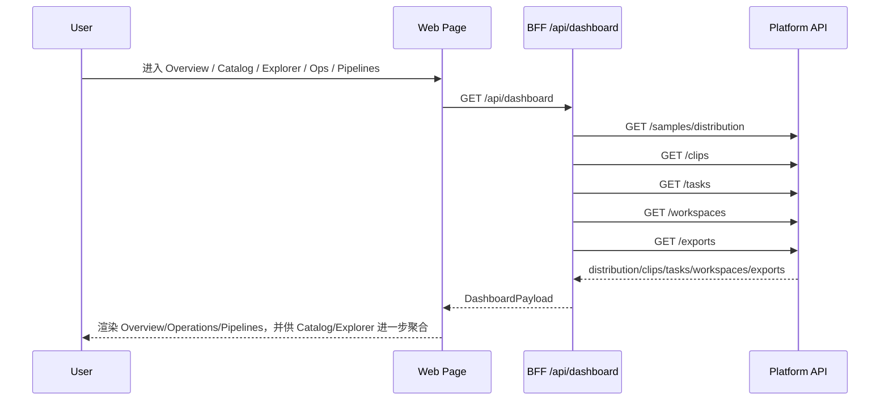
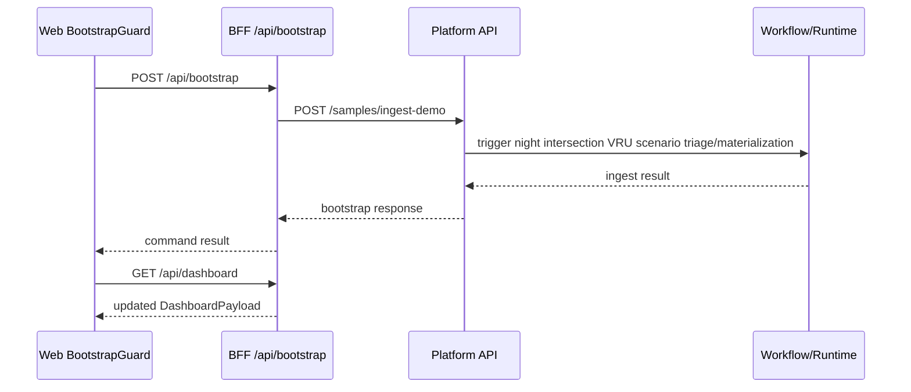
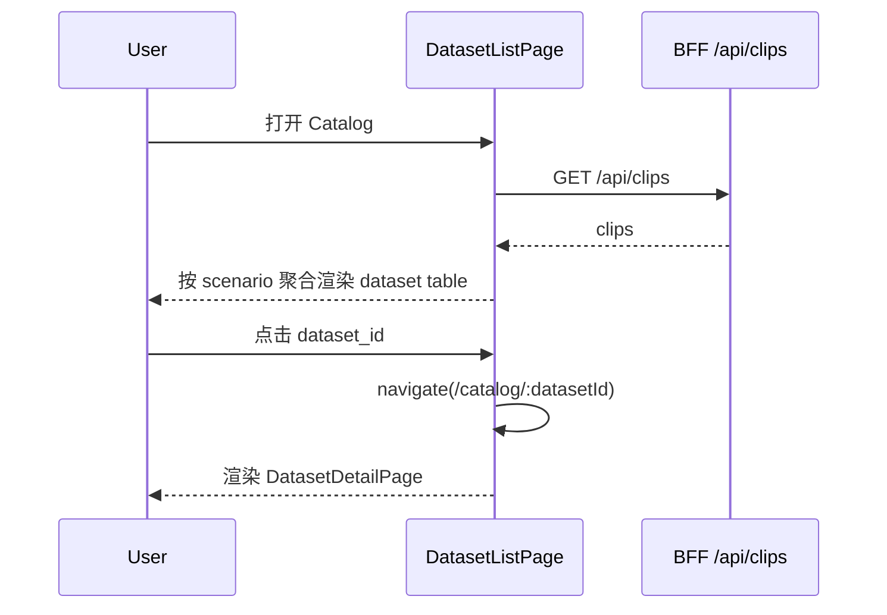
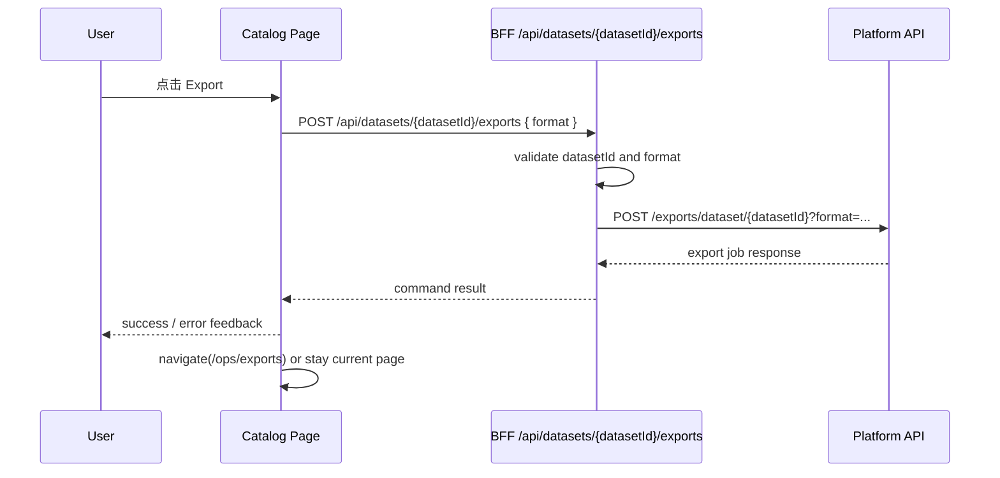
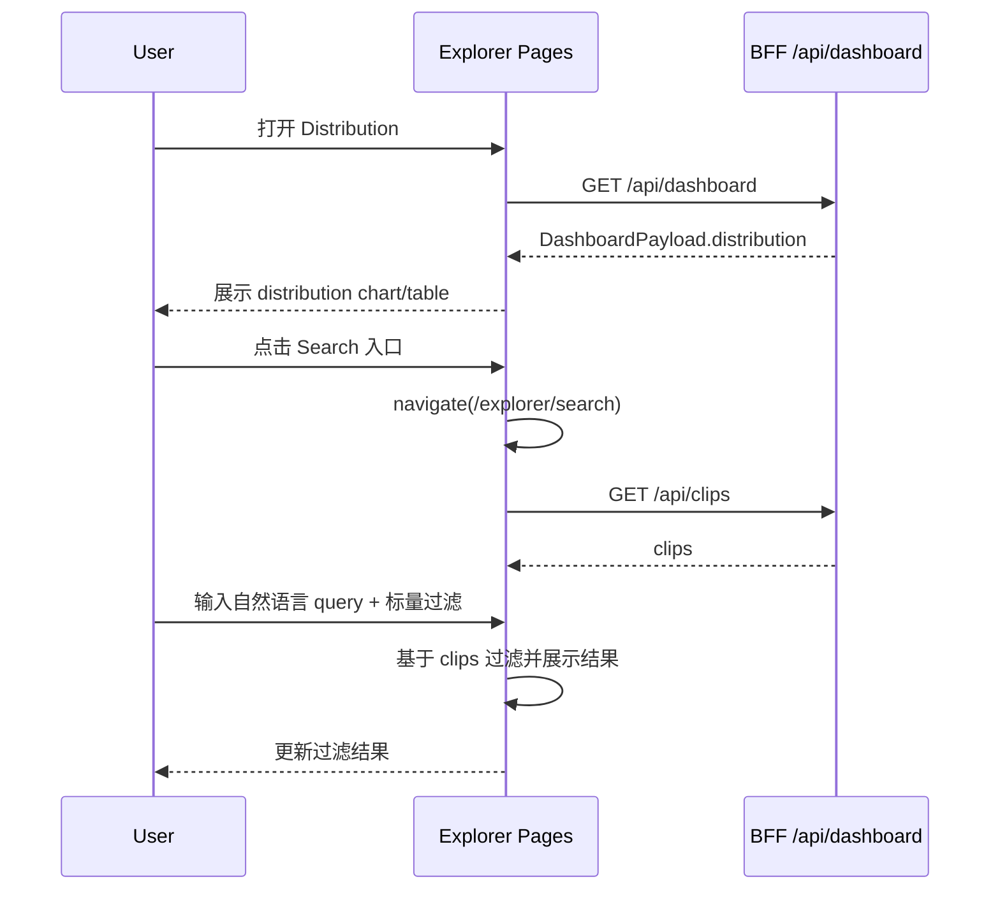
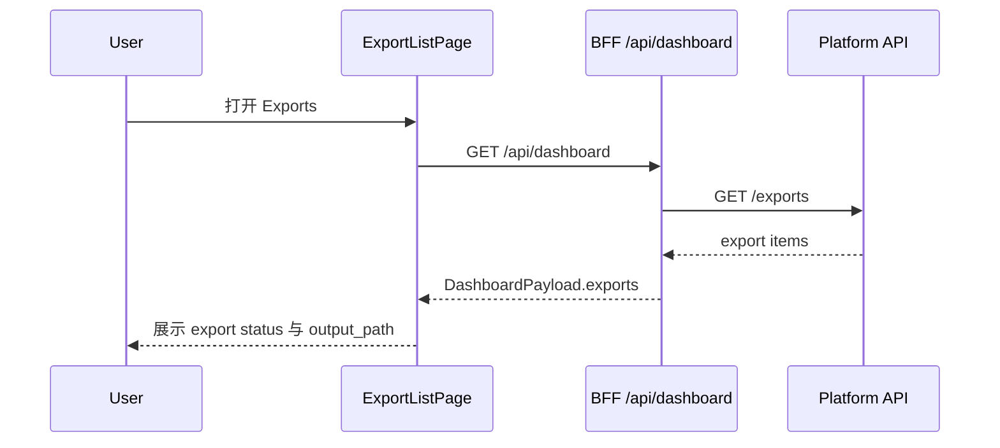

# 界面 Item 设计、页面流转与平台交互细节

## 目的

这份文档用于补齐 `ai-data-loop-engine` 在**体验访问层（Experience Access Layer）**的设计说明，回答三个问题：

1. 当前 workbench 的界面 item 应如何分层理解
2. 页面之间如何流转，用户在每一步看到什么、能做什么
3. Web、BFF、Platform API 之间的交互边界与数据责任如何划分

这份文档不做视觉稿或高保真交互稿，而是从系统设计层定义当前 MVP 的：

- workbench 信息架构
- 页面 item 类型与职责
- 页面流转
- 平台交互路径
- 当前实现的简化点与边界

## 与 PRD 和总体架构的关系

这份文档建立在以下设计之上：

- [AI Data Loop Infra PRD](../prd/ai-data-loop-infra-prd.md)
  - 定义统一工作台、统一任务与资产入口、Core Platform Layer / Domain Solution Layer 边界
- [总体架构说明](../architecture/overview.md)
  - 定义 `Web -> BFF -> Platform API -> RuntimeContainer / adapters` 的主链路
- [API 概览](../api/overview.md)
  - 区分 Experience Access API（BFF）与 Platform API（FastAPI）
- [首版 MVP 范围](../architecture/mvp-scope.md)
  - 说明当前 workbench 是刻意收敛后的 MVP，而不是完整企业级工作流平台

因此，这份文档聚焦的是：

- **体验访问层如何把平台能力组织成可理解、可操作的页面与交互**

而不是：

- 重新定义平台资源语义
- 重新定义 workflow / adapter / profile 的底层边界

## 当前体验访问层总体边界

当前推荐的访问路径是：

```text
User
-> Web Workbench
-> BFF (Experience Access API)
-> Platform API
-> workflows / services / runtime container
-> adapters / storage / query / metadata / search
```

其中：

- **Web** 负责页面渲染、路由切换、轻量本地状态和交互反馈
- **BFF** 负责页面级聚合、浏览器友好的 app-facing payload、最小命令转发
- **Platform API** 负责平台资源语义和 control-plane 入口
- **workflows / services** 负责执行具体业务流程与异步动作
- **runtime container / adapters** 负责环境装配与底层实现

这里的关键原则是：

- BFF 可以组织页面 ViewModel，但不拥有平台事实
- Platform API 拥有资源语义，但不直接负责页面聚合模型
- Web 消费的是 app-facing payload，而不是底层 provider 细节

## Workbench 信息架构

当前 Web workbench 按 6 个模块组织：

1. **Overview**
2. **Catalog**
3. **Explorer**
4. **Operations**
5. **Pipelines**
6. **Tools**

这些模块由 [apps/web/src/shared/layouts/nav-config.ts](../../apps/web/src/shared/layouts/nav-config.ts) 统一定义，并由 [apps/web/src/routes.tsx](../../apps/web/src/routes.tsx) 注册到路由系统中。

### 模块级导航结构

workbench 采用三层导航组织：

1. **Header**
   - 展示当前模块标签
   - 提供折叠、全屏等全局动作
2. **Micro Menu**
   - 展示五个一级模块入口
   - 用于模块级切换
3. **Sidebar**
   - 展示当前模块下的子页面入口
   - 用于页面级导航

这意味着用户体验不是“单页仪表盘”，而是一个最小工作台：

```text
模块选择
-> 模块子页面选择
-> 页面内动作
```

### 当前路由映射

| 路径 | 模块 | 页面 | 说明 |
| --- | --- | --- | --- |
| `/` | Overview | OverviewPage | 平台总览首页 |
| `/catalog` | Catalog | DatasetListPage | 数据集列表 |
| `/catalog/:datasetId` | Catalog | DatasetDetailPage | 数据集详情（按场景聚合的 clip 集） |
| `/explorer` | Explorer | DistributionPage | 数据分布总览 |
| `/explorer/search` | Explorer | SearchPage | 标量 + 语义占位联合检索 |
| `/explorer/clips` | Explorer | ClipListPage | Clip 列表与图片墙浏览 |
| `/explorer/clips/:clipId` | Explorer | ClipDetailPage | Clip 详情、Topic 预览与视频对齐播放 |
| `/ops` | Operations | TaskBoardPage | 任务看板 |
| `/ops/exports` | Operations | ExportListPage | 导出记录 |
| `/pipelines` | Pipelines | RunHistoryPage | 流水线运行历史 |
| `/tools` | Tools | ToolsHomePage | 工具总览与集成入口 |
| `/tools/:toolId` | Tools | ToolWorkspacePage | 工具工作空间 |

## 界面 Item 设计

这里的“item 设计”指的是页面中的核心交互与展示单元，而不是视觉样式细节。

### 1. 模块导航 Item

#### 1.1 Micro Menu Item

用于一级模块切换。

包含：

- 模块名称
- 图标
- 当前激活态
- 点击后跳转到该模块的第一个页面

当前模块包括：

- Overview
- Catalog
- Explorer
- Operations
- Pipelines
- Tools

#### 1.2 Sidebar Nav Item

用于模块内子页面切换。

包含：

- 子页面名称
- 目标路径
- 当前选中态

例如：

- Explorer 下有 `Distribution`、`Search`、`Clips`
- Operations 下有 `Tasks` 和 `Exports`

### 2. 页面容器 Item

#### 2.1 Page Container

页面统一使用 page container 模式承载：

- 页面标题
- 页面描述
- 页面级 actions 区域
- 页面主体内容

这种模式由 [apps/web/src/shared/components/page-container.tsx](../../apps/web/src/shared/components/page-container.tsx) 抽象，适合作为后续所有工作台页面的统一结构。

### 3. 数据展示 Item

#### 3.1 Stat Card

用于 Overview 页的汇总指标展示。

典型展示项：

- datasets 数量
- tasks 数量
- samples 数量
- exports 数量

设计原则：

- 用于快速感知平台状态
- 不承载复杂解释逻辑
- 应作为“入口摘要”，不是详细分析页

#### 3.2 Data Table

当前 MVP 最主要的数据展示 item。

适用于：

- dataset 列表
- dataset member clips 列表
- task 列表
- export 列表
- search clip 结果列表
- run history 列表

典型列包括：

- 标识列（id / name）
- 状态列
- 类型列
- 归属列
- 动作列

设计原则：

- 列结构稳定
- 支持定制 cell renderer
- 支持从列表进入详情页或执行命令
- 作为 MVP 阶段的核心 list/detail UI 模式

#### 3.3 Status Badge

用于统一展示任务、导出、运行状态。

当前状态集合为：

- `pending`
- `running`
- `done`
- `failed`
- `canceled`

设计原则：

- 状态语义统一
- 不在页面内重复发明状态枚举
- 后续页面应尽量复用同一状态可视化模式

#### 3.4 Recent Activity Item

用于 Overview 页展示近期任务和导出活动。

作用：

- 给用户提供平台最近动作的摘要
- 帮助用户快速决定下一步跳转方向

#### 3.5 Quick Action Item

用于 Overview 页提供高频入口。

当前应视为：

- 页面跳转捷径
- 而不是重型流程触发器

适合放置：

- 浏览数据集
- 查看分布
- 搜索样本
- 查看导出

### 4. 命令型 Item

#### 4.1 Bootstrap Action

职责：

- 初始化 demo 数据环境
- 触发最小 ingestion/materialization 主链路

当前特征：

- 通过 `POST /api/bootstrap` 触发
- 在应用加载时 best-effort 执行
- 更像“环境引导动作”，不是长期保留的业务主操作

#### 4.2 Export Action

职责：

- 从数据资产视图发起导出
- 通过 BFF 转发到 Platform API
- 将结果沉淀到 exports 视图

当前特征：

- 支持 `lance / csv / jsonl` 等格式
- 在当前 Catalog（clip 聚合视图）中，主动作已从“导出”转为“下钻浏览”

### 5. 状态反馈 Item

所有页面都应具备最小反馈 item：

- loading state
- empty state
- error state
- action completed state

当前 MVP 的实现还较轻，但在文档层应提前将其定义为体验访问层的标准组成。

## 字段级 Item 设计表

本节将“页面 item”进一步下钻到字段级，定义页面渲染时最小可见字段、交互属性和来源边界。

字段设计遵循三条原则：

1. **字段尽量直接映射当前 `DashboardPayload` 或命令响应**
2. **页面只消费 app-facing 字段，不暴露底层 provider 细节**
3. **MVP 阶段允许部分字段为派生字段，但必须明确派生规则**

### 1. 全局导航与容器字段

#### 1.1 Header Item 字段表

| 字段 | 类型 | 来源 | 必填 | 说明 |
| --- | --- | --- | --- | --- |
| `currentMenuLabel` | string | 当前激活 nav group | 是 | 当前模块标题 |
| `collapseMicroApp` | boolean | Web local state / localStorage | 是 | 一级模块栏是否折叠 |
| `collapseMenu` | boolean | Web local state / localStorage | 是 | sidebar 是否折叠 |
| `fullscreen` | boolean | Web local state | 是 | 是否全屏 |
| `onToggleMicroApp` | action | Web interaction | 是 | 切换 micro menu |
| `onToggleMenu` | action | Web interaction | 是 | 切换 sidebar |
| `onToggleFullscreen` | action | Web interaction | 是 | 切换全屏 |

#### 1.2 Micro Menu Item 字段表

| 字段 | 类型 | 来源 | 必填 | 说明 |
| --- | --- | --- | --- | --- |
| `label` | string | `navGroups[].label` | 是 | 模块名 |
| `icon` | string | `navGroups[].icon` | 是 | 模块图标 |
| `active` | boolean | 当前路由匹配 | 是 | 是否激活 |
| `targetPath` | string | `navGroups[].items[0].path` | 是 | 进入模块默认页 |

#### 1.3 Sidebar Nav Item 字段表

| 字段 | 类型 | 来源 | 必填 | 说明 |
| --- | --- | --- | --- | --- |
| `label` | string | `navGroups[].items[].label` | 是 | 子页面名称 |
| `path` | string | `navGroups[].items[].path` | 是 | 路由路径 |
| `active` | boolean | 当前路由匹配 | 是 | 是否选中 |

#### 1.4 Page Container 字段表

| 字段 | 类型 | 来源 | 必填 | 说明 |
| --- | --- | --- | --- | --- |
| `title` | string | 页面定义 | 是 | 页面标题 |
| `description` | string | 页面定义 | 否 | 页面说明 |
| `actions` | ReactNode | 页面定义 | 否 | 页面级操作区 |
| `children` | ReactNode | 页面定义 | 是 | 主体内容 |

### 2. Overview 页面字段级 Item

#### 2.1 PlatformStats 字段表

| 展示字段 | 类型 | 来源 | 派生规则 | 说明 |
| --- | --- | --- | --- | --- |
| `datasetCount` | number | `datasets.length` | 直接计数 | 数据集总数 |
| `taskCount` | number | `tasks.length` | 直接计数 | 任务总数 |
| `sampleCount` | number | `distribution[].sample_count` | 聚合求和 | 样本总量近似值 |
| `exportCount` | number | `exports.length` | 直接计数 | 导出记录数 |

#### 2.2 QuickActions 字段表

| 字段 | 类型 | 来源 | 必填 | 说明 |
| --- | --- | --- | --- | --- |
| `label` | string | 页面定义 | 是 | 动作名称 |
| `description` | string | 页面定义 | 否 | 动作说明 |
| `targetPath` | string | 页面定义 | 是 | 跳转路由 |
| `disabled` | boolean | Web local rule | 是 | 是否禁用 |

推荐动作集合：

- `Browse Datasets` -> `/catalog`
- `View Distribution` -> `/explorer`
- `Search Samples` -> `/explorer/search`
- `View Exports` -> `/ops/exports`

#### 2.3 RecentActivity 字段表

| 字段 | 类型 | 来源 | 派生规则 | 说明 |
| --- | --- | --- | --- | --- |
| `type` | `'task' | 'export'` | `tasks` / `exports` | 合并列表 | 活动类型 |
| `id` | string | `task_id` / `export_id` | 直接映射 | 活动主键 |
| `title` | string | `title` / `dataset_id` | 直接映射/派生 | 活动标题 |
| `status` | string | `status` | 直接映射 | 活动状态 |
| `targetPath` | string | 页面规则 | 由 type 派生 | 跳转目标 |

### 3. Catalog 页面字段级 Item

#### 3.1 Dataset Table 字段表

| 列字段 | 类型 | 来源 | 交互 | 说明 |
| --- | --- | --- | --- | --- |
| `dataset_id` | string | 前端派生：`scenario:<name>` | 可点击 | 数据集分组 id，进入详情 |
| `name` | string | 前端派生 | 只读 | 分组显示名（scenario 或 unassigned） |
| `clip_count` | number | 聚合 `clips[]` | 只读 | 该分组 clip 数 |
| `keyframe_total` | number | 聚合 `clips[].keyframe_count` | 只读 | 总 keyframe 数 |
| `duration_total_seconds` | number | 聚合 `clips[].duration_seconds` | 只读 | 总时长 |
| `vehicle_names` | string[] | 聚合 `clips[].vehicle_name` | 只读 | 车辆集合 |
| `cities` | string[] | 聚合 `clips[].city` | 只读 | 城市集合 |
| `tags` | string[] | 聚合 `clips[].tags` | 只读 | 标签集合 |

#### 3.2 Dataset Detail Summary 字段表

| 字段 | 类型 | 来源 | 说明 |
| --- | --- | --- | --- |
| `dataset_id` | string | 路由参数 | 当前 dataset 分组主键 |
| `name` | string | 聚合结果 | 分组名称 |
| `scenario` | string \| null | 聚合结果 | 对应 scenario |
| `clip_count` | number | 聚合结果 | 分组 clip 数 |
| `keyframe_total` | number | 聚合结果 | 分组 keyframe 总数 |
| `duration_total_seconds` | number | 聚合结果 | 分组总时长 |
| `member_clips[]` | array | 过滤 `clips[]` | 分组内 clip 列表 |

#### 3.3 Dataset Member Clips 字段表

| 列字段 | 类型 | 来源 | 说明 |
| --- | --- | --- | --- |
| `clip_id` | string | `clips[].clip_id` | clip 主键 |
| `vehicle_name` | string \| null | `clips[].vehicle_name` | 车辆信息 |
| `city` / `district` | string \| null | `clips[]` | 位置信息 |
| `start_time` | number \| null | `clips[].start_time` | 起始时间 |
| `duration_seconds` | number \| null | `clips[].duration_seconds` | 时长 |
| `keyframe_count` | number | `clips[].keyframe_count` | keyframe 数 |

#### 3.4 Dataset Drilldown Command 字段表

| 字段 | 类型 | 来源 | 必填 | 说明 |
| --- | --- | --- | --- | --- |
| `datasetId` | string | 当前 dataset / 当前行 | 是 | 场景分组 id |
| `scenario` | string \| null | 当前 dataset | 否 | 用于预过滤 |
| `targetPath` | string | 页面规则 | 是 | `/explorer/search` 或 `/explorer/clips` |
| `query` | object | 页面规则 | 否 | URL 参数（`dataset` / `scenario`） |

### 4. Explorer 页面字段级 Item

#### 4.1 Distribution Table / Chart 字段表

| 字段 | 类型 | 来源 | 说明 |
| --- | --- | --- | --- |
| `scene` | string | `distribution[].scene` | 分布维度 |
| `sample_count` | number | `distribution[].sample_count` | 场景样本数 |
| `share` | number | 前端派生 | `sample_count / total` 的占比 |

#### 4.2 Search Input 字段表

| 字段 | 类型 | 来源 | 说明 |
| --- | --- | --- | --- |
| `naturalLanguage` | string | Web local state | 用户自然语言输入（语义占位） |
| `keyword` | string | Web local state | 标量关键词过滤 |
| `scenario` | string \| null | Web local state / URL | 场景过滤 |
| `vehicle` | string \| null | Web local state / URL | 车辆过滤 |
| `city` | string \| null | Web local state / URL | 城市过滤 |
| `tags` | string[] | Web local state / URL | 标签过滤（AND） |
| `vectorBackendReady` | boolean | 平台能力状态 | 当前是否接入向量后端 |

#### 4.3 Search Result Table 字段表

| 列字段 | 类型 | 来源 | 说明 |
| --- | --- | --- | --- |
| `clip_id` | string | `clips[].clip_id` | clip 标识 |
| `scenario` | string \| null | `clips[].scenario` | 场景标签 |
| `vehicle_name` | string \| null | `clips[].vehicle_name` | 车辆 |
| `city` / `district` | string \| null | `clips[]` | 位置信息 |
| `duration_seconds` | number \| null | `clips[].duration_seconds` | 时长 |
| `matched` | boolean | Web local rule | 是否命中当前标量过滤 |
| `semantic_query` | string | Web local state | 当前语义占位查询文本 |

#### 4.4 Clips List / Wall 字段表

| 字段 | 类型 | 来源 | 说明 |
| --- | --- | --- | --- |
| `clip_id` | string | `clips[].clip_id` | clip 唯一标识 |
| `start_time` | number \| null | `clips[].start_time` | 起始时间戳（ns） |
| `duration_seconds` | number \| null | `clips[].duration_seconds` | 时长（秒） |
| `vehicle_name` | string \| null | `clips[].vehicle_name` | 车辆名 |
| `city` / `district` | string \| null | `clips[].city/district` | 城市与区域 |
| `scenario` | string \| null | `clips[].scenario` | 场景标签 |
| `topics_count` | number | 前端派生 | `clips[].topics.length` |
| `cameras_count` | number | 前端派生 | `clips[].cameras.length` |
| `tags` | string \| null | `clips[].tags` | 业务标签 |
| `view_mode` | `'table' \| 'wall'` | Web local state | 当前展示模式 |

#### 4.5 Clip Detail 字段表

| 字段 | 类型 | 来源 | 说明 |
| --- | --- | --- | --- |
| `item` | object | `GET /api/clips/{clipId}` | clip 摘要信息 |
| `meta` | object | `GET /api/clips/{clipId}` | meta.lance 字段聚合 |
| `schema` | object | `GET /api/clips/{clipId}` | topic/standalone schema 信息 |
| `camera_catalog[]` | array | `GET /api/clips/{clipId}` | 摄像头列表与标定摘要 |
| `camera_catalog[].has_local_video` | boolean | 后端派生 | 本地缓存是否存在 |
| `camera_catalog[].mp4_path` | string \| null | `meta.mp4_path[camera]` | 原始 OSS 视频 URI |
| `camera_catalog[].mp4_resize_paths` | string[] | `meta.mp4_resize_path[camera]` | 缩略/分级视频 URI 列表 |
| `aligned_frames[]` | array | `/cameras/{camera}/aligned` | 对齐帧索引表 |
| `topic_rows[]` | array | `/frames` 或 `/standalone/{name}` | topic 样本预览行 |

### 5. Operations 页面字段级 Item

#### 5.1 Task Table 字段表

| 列字段 | 类型 | 来源 | 说明 |
| --- | --- | --- | --- |
| `task_id` | string | `tasks[].task_id` | 任务主键 |
| `title` | string | `tasks[].title` | 任务标题 |
| `status` | string | `tasks[].status` | 任务状态 |
| `task_type` | string | `tasks[].task_type` | 任务类型 |

#### 5.2 Export Table 字段表

| 列字段 | 类型 | 来源 | 说明 |
| --- | --- | --- | --- |
| `export_id` | string | `exports[].export_id` | 导出主键 |
| `dataset_id` | string | `exports[].dataset_id` | 对应 dataset |
| `format` | string | `exports[].format` | 导出格式 |
| `status` | string | `exports[].status` | 导出状态 |
| `output_path` | string | `exports[].output_path` | 输出路径 |

### 6. Pipelines 页面字段级 Item

#### 6.1 Run History Table 字段表

当前实现中 `Pipelines` 页面主要复用 task/run 风格数据，因此字段设计保持最小：

| 列字段 | 类型 | 推荐来源 | 说明 |
| --- | --- | --- | --- |
| `run_id` | string | 当前可由 `task_id` 近似映射 | 运行记录标识 |
| `title` | string | `tasks[].title` | 运行标题 |
| `status` | string | `tasks[].status` | 运行状态 |
| `run_type` | string | `tasks[].task_type` | 运行类型 |

### 7. Tools 页面字段级 Item

#### 7.1 Tool Registry Item 字段表

| 字段 | 类型 | 来源 | 说明 |
| --- | --- | --- | --- |
| `id` | string | `toolRegistry[].id` | 工具唯一标识 |
| `name` | string | `toolRegistry[].name` | 工具名称 |
| `category` | string | `toolRegistry[].category` | 工具类别 |
| `integrationMode` | string | `toolRegistry[].integrationMode` | 集成模式 |
| `workspacePath` | string | `toolRegistry[].workspacePath` | 工作空间路径 |
| `gatewayPath` | string | `toolRegistry[].gatewayPath` | 代理网关路径 |

#### 7.2 Tool Workspace Context 字段表

| 字段 | 类型 | 推荐来源 | 说明 |
| --- | --- | --- | --- |
| `workspaceId` | string | BFF 聚合上下文 | 当前工作空间 |
| `datasetVersionId` | string | BFF 聚合上下文 | 当前激活数据版本 |
| `requestId` | string | BFF 注入 | 跨工具调用追踪 |
| `actor` | string | session / BFF | 当前操作者 |

#### 7.3 Tool Runtime Health 字段表

| 字段 | 类型 | 推荐来源 | 说明 |
| --- | --- | --- | --- |
| `status` | `'healthy' | 'degraded' | 'down'` | BFF 探活聚合 | 工具运行健康状态 |
| `lastHeartbeatAt` | string | BFF 探活聚合 | 最近心跳时间 |
| `errorSummary` | string | BFF 探活聚合 | 最近错误摘要 |

## 页面设计与页面流转

下面按当前模块说明页面设计和核心流转。

### 1. Overview

#### 页面目标

让用户在进入 workbench 后快速回答：

- 当前平台里有什么
- 最近发生了什么
- 我下一步应该去哪里

#### 核心 item

- PlatformStats
- QuickActions
- RecentActivity

#### 数据来源

- BFF `GET /api/dashboard`

#### 页面动作

- 跳转到 Catalog
- 跳转到 Explorer
- 跳转到 Search
- 跳转到 Exports

#### 页面流转

```text
进入系统
-> Overview
-> 查看统计卡片与最近活动
-> 选择进入 Catalog / Explorer / Operations / Pipelines
```

### 2. Catalog

#### 2.1 Dataset List Page

##### 页面目标

让用户查看当前平台中有哪些数据集分组，并从分组下钻到 clips 与 clip 详情。

##### 核心 item

- Dataset aggregate table
- 场景分组说明
- Dataset id/detail link

##### 数据来源

- 当前通过 `GET /api/clips` 在前端按 `scenario` 聚合得到 dataset 视图

##### 页面动作

- 查看数据集详情
- 跳转 Explorer Search（带 dataset/scenario 上下文）
- 跳转 Explorer Clips（带 scenario 预过滤）

##### 页面流转

```text
Overview / Catalog 入口
-> Dataset List（scenario 聚合）
-> 点击 dataset id
-> Dataset Detail
```

#### 2.2 Dataset Detail Page

##### 页面目标

让用户查看单个 dataset 分组（scenario bucket）的画像与成员 clips，并继续下钻。

##### 核心 item

- Dataset profile summary
- Member clips table/wall
- Search in Explorer action
- Browse clips action / Back action

##### 数据来源

- `GET /api/clips`（按 dataset id 对应的 scenario 分组过滤）

##### 页面动作

- 返回列表
- 下钻到 Explorer Search（预置 dataset/scenario）
- 下钻到 Explorer Clips（预置 scenario）
- 下钻到 Clip Detail（携带 dataset 回链参数）

##### 页面流转

```text
Dataset List
-> Dataset Detail
-> 查看成员 clips
-> 进入 Search / Clips / Clip Detail
```

### 3. Explorer

#### 3.1 Distribution Page

##### 页面目标

让用户从聚合视角理解当前样本分布。

##### 核心 item

- Distribution chart
- Distribution table
- 跳转 Search 的 action

##### 数据来源

- `GET /api/dashboard` 中的 `distribution`

##### 页面动作

- 进入 Search 页面

##### 页面流转

```text
Overview / Explorer 入口
-> Distribution
-> 查看场景分布
-> 跳转 Search
```

#### 3.2 Search Page

##### 页面目标

让用户执行标量 + 语义（自然语言占位）联合查询，并定位到具体 clip。

##### 核心 item

- Natural language search input（向量语义检索占位）
- Scalar filters（scenario/vehicle/city/tags/keyword）
- Search result table（clip 粒度）

##### 数据来源

- `GET /api/clips`（当前实现）
- 未来 `GET /api/explorer/search`（联合检索 read model）

##### 当前实现约束

- 标量过滤已可用（前端过滤 clip metadata）
- 语义检索以 `Search using natural language` 交互先行占位
- 向量后端暂未接入，结果仍由标量过滤生成

##### 页面流转

```text
Distribution
-> Search
-> 输入自然语言 + 标量条件
-> 得到 clip 结果
-> 进入 Clip Detail
```

#### 3.3 Clips Page

##### 页面目标

让用户按 clip 维度浏览数据，支持从概览到单 clip 深入分析（metadata、topic、视频）。

##### 核心 item

- Clips list/table 视图
- Clips wall（图片墙）视图
- 关键词过滤（clip id / vehicle / city / scenario / tags）
- 跳转 clip 详情页

##### 数据来源

- `GET /api/clips`

并可从 URL 上下文参数预置筛选：

- `dataset`：上卷回 Catalog dataset detail
- `scenario`：预过滤 clips

##### 页面动作

- 视图模式切换（`table` / `wall`）
- 进入 clip 详情

##### 页面流转

```text
Explorer
-> Clips
-> table/wall 切换 + 关键词过滤
-> 进入 Clip Detail
```

#### 3.4 Clip Detail Page

##### 页面目标

让用户在单个 clip 下查看结构化元信息、topic 帧样本，以及摄像头视频与对齐索引。

##### 核心 item

- Meta summary（时间范围、车辆、城市、场景、标签）
- Camera catalog（分辨率、FOV、内外参摘要）
- 视频播放与 seek（基于对齐帧）
- Topic/Standalone topic 帧预览
- `mp4_path` 与 `mp4_resize_path` 展示

##### 数据来源

- `GET /api/clips/{clipId}`
- `GET /api/clips/{clipId}/frames`
- `GET /api/clips/{clipId}/standalone/{name}`
- `GET /api/clips/{clipId}/cameras/{camera}/aligned`
- `GET /api/clips/{clipId}/cameras/{camera}/video`

##### 当前实现约束

- 视频播放依赖本地缓存路径 `data/raw/thumbnail_video/<clip_id>/<camera>.mp4`
- 缩略视频优先来源于 `meta.mp4_resize_path[camera][0]`，缺失时回退 `meta.mp4_path[camera]`
- 对齐帧当前以固定 fps 近似 seek，后续可升级为由元数据提供 fps
- 支持依据 URL 参数进行上卷导航（返回 dataset 或 requirement）

##### 页面流转

```text
Clips List/Wall
-> Clip Detail
-> 选择 Camera
-> 播放视频 + 点击对齐帧跳转
-> 切换 Topic / Standalone 预览
```

### 4. Operations

#### 4.1 Task Board Page

##### 页面目标

让用户查看当前任务状态。

##### 核心 item

- task table
- status badge

##### 数据来源

- `GET /api/dashboard` 中的 `tasks`

##### 页面流转

```text
Overview / Operations 入口
-> Task Board
-> 查看任务状态
```

#### 4.2 Export List Page

##### 页面目标

让用户查看导出结果与输出路径。

##### 核心 item

- export table
- status badge
- output path

##### 数据来源

- `GET /api/dashboard` 中的 `exports`

##### 页面流转

```text
Dataset List / Dataset Detail 发起 Export
-> Export List
-> 查看导出状态与输出路径
```

### 5. Pipelines

#### Run History Page

##### 页面目标

让用户查看当前 MVP 中的运行历史视图。

##### 核心 item

- run history table
- status badge

##### 当前实现约束

当前 `Pipelines` 页面仍是 MVP 近似表达：

- 它不是完整独立的 pipeline studio
- 当前主要复用 task / run 风格的数据进行展示

因此文档必须明确：

- 当前页是运行历史视图
- 不是完整的 DAG 编排与运行控制系统

##### 页面流转

```text
Overview / Pipelines 入口
-> Run History
-> 查看运行记录与状态
```

### 6. Tools

#### 6.1 Tools Hub Page

##### 页面目标

将工具目录升级为统一控制面入口，提供工具状态、集成模式、关键健康摘要与统一工作空间导航。

##### 核心 item

- Tool catalog cards
- Integration mode / gateway metadata
- Health summary
- Workspace entry actions

##### 页面流转

```text
Overview / Tools 入口
-> Tools Hub
-> 选择某个工具
-> Tool Workspace
```

#### 6.2 Tool Workspace Page

##### 页面目标

在统一平台壳内承载工具运行视图，并提供跨工具一致的上下文、重试与降级策略。

##### 核心 item

- Embedded tool frame
- Runtime status badge
- Quick links
- Fallback panel (new tab / retry)

##### 页面流转

```text
Tools Hub
-> Tool Workspace
-> (frame delayed) fallback panel
-> 重试嵌入 or 新标签打开
```

##### 对 Modern Data Stack 愿景的支撑

Tools 模块不是单纯工具列表，而是统一运行和治理入口的前端承载位。后续应逐步承接：

1. 统一上下文桥接（workspaceId、datasetVersionId、requestId）
2. 统一运行状态聚合（run/quality/lineage/alert）
3. 统一集成治理（contractVersion、policyProfile、health）

## 页面状态机

本节将页面从“静态页面”进一步抽象为“状态驱动视图”，帮助后续实现 loading / empty / error / command feedback 的一致交互。

状态机统一约定：

- `idle`：页面初始尚未发起数据请求
- `loading`：正在请求 BFF 数据
- `ready`：数据成功加载且可正常渲染
- `empty`：请求成功但无可展示数据
- `error`：请求失败
- `submitting`：页面上的命令型动作提交中
- `success_feedback`：命令成功后的短暂反馈态

### 1. Overview 页面状态机

```text
idle
-> loading
-> ready            (dashboard payload 加载成功且存在至少一种内容)
-> empty            (dashboard payload 成功但关键区块全空)
-> error            (dashboard 请求失败)

ready
-> ready            (模块导航切换后返回)
-> error            (后续刷新失败)
```

### 2. Dataset List 页面状态机

```text
idle
-> loading
-> ready            (datasets 非空)
-> empty            (datasets 为空)
-> error            (dashboard 请求失败)

ready
-> submitting       (点击 Export)
-> ready            (点击 dataset id 进入详情前)

submitting
-> success_feedback (导出创建成功)
-> error            (导出失败)

success_feedback
-> ready            (提示消失或跳转 Exports)
```

### 3. Dataset Detail 页面状态机

```text
idle
-> loading
-> ready            (dataset 命中，member clips 可渲染)
-> empty            (dataset 不存在或 member clips 为空)
-> error            (clips 请求失败)

ready
-> ready            (切换 table/wall)
-> ready            (点击 Back / Search in Explorer / Browse clips)
```

### 4. Distribution 页面状态机

```text
idle
-> loading
-> ready            (distribution 有数据)
-> empty            (distribution 为空)
-> error            (dashboard 请求失败)

ready
-> ready            (切换图表/表格视图)
-> ready            (跳转 Search)
```

### 5. Search 页面状态机

```text
idle
-> loading
-> ready            (clips 成功加载)
-> empty            (clips 为空)
-> error            (clips 请求失败)

ready
-> ready            (输入自然语言 + 标量过滤且结果仍存在)
-> empty            (过滤后无匹配)
```

### 6. Task Board 页面状态机

```text
idle
-> loading
-> ready            (tasks 非空)
-> empty            (tasks 为空)
-> error            (dashboard 请求失败)
```

### 7. Export List 页面状态机

```text
idle
-> loading
-> ready            (exports 非空)
-> empty            (exports 为空)
-> error            (dashboard 请求失败)

ready
-> ready            (导出状态刷新)
```

### 8. Run History 页面状态机

```text
idle
-> loading
-> ready            (runs/tasks 可展示)
-> empty            (无运行记录)
-> error            (dashboard 请求失败)
```

### 9. Tools 页面状态机

```text
idle
-> loading
-> ready            (tools registry 可展示)
-> empty            (无已接入工具)
-> error            (tools 聚合请求失败)

ready
-> loading          (进入 Tool Workspace 并建立嵌入连接)
-> ready            (iframe onLoad)
-> delayed          (超时未完成嵌入)

delayed
-> loading          (用户点击 retry)
-> ready            (重试成功)
-> ready            (切换为 new tab 访问，页面保留可用态)
```

## BFF ViewModel 设计稿

当前 BFF 已提供统一聚合模型 `DashboardPayload`，定义于 [apps/bff/src/services/dashboard.ts](../../apps/bff/src/services/dashboard.ts)。从页面设计角度，建议将它视为 **WorkbenchShellViewModel + 各页面切片 ViewModel 的源模型**。

### 1. 当前聚合模型

```ts
type DashboardPayload = {
  distribution: DistributionRow[]
  clips: ClipSummary[]
  tasks: TaskItem[]
  workspaces: WorkspaceItem[]
  exports: ExportItem[]
}
```

这个模型的价值是：

- 让 BFF 在一次请求中完成多资源 fan-out
- 让 Web 在 MVP 阶段低成本搭建统一工作台
- 让多个页面共享同一份 app-facing contract

它的局限是：

- 页面边界仍偏隐式
- 某些页面只能在前端做二次派生
- command success/error feedback 还未进入显式 ViewModel

### 2. 推荐的页面切片 ViewModel

#### 2.1 OverviewViewModel

```ts
type OverviewViewModel = {
  stats: {
    datasetCount: number
    taskCount: number
    sampleCount: number
    exportCount: number
  }
  quickActions: Array<{
    key: 'catalog' | 'distribution' | 'search' | 'exports'
    label: string
    targetPath: string
  }>
  recentActivities: Array<{
    type: 'task' | 'export'
    id: string
    title: string
    status: string
    targetPath: string
  }>
}
```

#### 2.2 DatasetListViewModel

```ts
type DatasetListViewModel = {
  items: Array<{
    datasetId: string
    name: string
    workspaceId: string
    profile: string
    detailPath: string
    availableFormats: Array<'lance' | 'csv' | 'jsonl'>
  }>
}
```

#### 2.3 DatasetDetailViewModel

```ts
type DatasetDetailViewModel = {
  dataset: {
    datasetId: string
    name: string
    workspaceId: string
    profile: string
  }
  versions: Array<{
    versionId: string
    sampleCount: number
    tableName: string
  }>
  commands: {
    export: {
      endpoint: string
      defaultFormat: 'lance'
      availableFormats: Array<'lance' | 'csv' | 'jsonl'>
    }
  }
}
```

#### 2.4 DistributionViewModel

```ts
type DistributionViewModel = {
  rows: Array<{
    scene: string
    sampleCount: number
    share: number
  }>
  actions: {
    goSearchPath: string
  }
}
```

#### 2.5 SearchViewModel

```ts
type SearchViewModel = {
  queryModel: {
    mode: 'local-preview-filter'
    placeholder: string
  }
  rows: Array<{
    id: string
    scene: string
    datasetVersionId?: string
  }>
}
```

#### 2.6 TaskBoardViewModel

```ts
type TaskBoardViewModel = {
  items: Array<{
    taskId: string
    title: string
    status: string
    taskType: string
  }>
}
```

#### 2.7 ExportListViewModel

```ts
type ExportListViewModel = {
  items: Array<{
    exportId: string
    datasetId: string
    format: string
    status: string
    outputPath: string
  }>
}
```

#### 2.8 RunHistoryViewModel

```ts
type RunHistoryViewModel = {
  items: Array<{
    runId: string
    title: string
    status: string
    runType: string
  }>
  note: 'MVP approximation based on task/run style data'
}
```

### 3. 命令型响应 ViewModel

对于 `POST /api/bootstrap` 与 `POST /api/datasets/{datasetId}/exports`，建议增加统一 command response 设计语义：

```ts
type CommandFeedback = {
  success: boolean
  message?: string
  errorCode?: string
  errorMessage?: string
}
```

目的不是重定义 Platform API 响应，而是让 BFF 可以逐步为页面提供一致的 action feedback contract。

### 4. 推荐演进路径

1. 继续保留 `GET /api/dashboard` 作为 shell 聚合接口
2. 在 BFF 内显式实现 page selector / mapper
3. 逐步收敛出：
   - `GET /api/overview`
   - `GET /api/catalog/datasets`
   - `GET /api/catalog/datasets/:id`
   - `GET /api/explorer/distribution`
  - `GET /api/explorer/search` (scalar + vector hybrid read model)
  - `GET /api/clips`
  - `GET /api/clips/:clipId`
  - `GET /api/clips/:clipId/frames`
  - `GET /api/clips/:clipId/standalone/:name`
  - `GET /api/clips/:clipId/cameras/:camera/aligned`
  - `GET /api/clips/:clipId/cameras/:camera/video`
   - `GET /api/ops/tasks`
   - `GET /api/ops/exports`
   - `GET /api/pipelines/runs`
4. 保持 command endpoint 单独存在，不混入 read model payload
5. 增加 tools 聚合 read model：
  - `GET /api/tools/registry`
  - `GET /api/tools/:toolId/workspace-context`
  - `GET /api/tools/:toolId/health`

## 平台交互细节

### 1. Web 侧职责

Web 负责：

- 路由管理
- workbench 布局组织
- 页面级数据展示
- 局部交互状态
- 触发 BFF 请求
- 基于 app-facing payload 渲染页面

Web 不负责：

- 平台资源语义定义
- 多资源聚合逻辑
- workflow orchestration
- runtime provider 选择

### 2. BFF 侧职责

BFF 负责：

- 提供 Experience Access API
- 聚合多个 Platform API 资源
- 组织页面友好的 ViewModel
- 转发最小命令型动作
- 屏蔽部分前端不应直接感知的平台细节

当前最重要的 BFF 聚合逻辑在：

- [apps/bff/src/services/dashboard.ts](../../apps/bff/src/services/dashboard.ts)

当前返回的核心聚合模型是：

- `DashboardPayload`

包含：

- `distribution`
- `clips`
- `tasks`
- `workspaces`
- `exports`

其中 Catalog dataset 视图与 Search 结果由 Web/BFF 基于 `clips` 进行页面级聚合与过滤。

这意味着在 MVP 阶段，多个页面共享同一个 app-facing 聚合 payload，再由前端按页面切片消费。

### 3. Platform API 侧职责

Platform API 负责：

- dataset / clip / task / workspace / export / samples 等资源语义
- ingestion、export 等平台控制动作入口
- 与 runtime container / workflows 的连接

Platform API 不负责：

- 页面导航结构
- 页面级汇总卡片模型
- 前端友好字段拼装

### 4. 关键交互路径

#### 4.1 Dashboard 聚合交互

```text
Web page
-> GET /api/dashboard
-> BFF fan-out:
   - /samples/distribution
  - /clips
   - /tasks
   - /workspaces
   - /exports
-> BFF build DashboardPayload
-> Web slices payload for Overview / Ops / Pipelines
-> Catalog/Search/Clips 在页面层基于 clips 构建 ViewModel
```

这是当前 MVP 最核心的页面交互模式。

#### 4.2 Bootstrap 交互

```text
App mount
-> Web BootstrapGuard
-> POST /api/bootstrap
-> BFF forward to Platform API /samples/ingest-demo
-> Platform API triggers night intersection VRU scenario triage/materialization
-> 数据进入 dashboard/catalog/explorer 的可见范围
```

这里的关键是：

- bootstrap 是平台初始化动作
- 当前由应用加载 best-effort 触发
- 它更偏 demo/MVP 启动辅助，而不是长期稳定保留的业务动作

#### 4.3 Export 交互

```text
User clicks Export
-> Web POST /api/datasets/{datasetId}/exports
-> BFF validate params/body
-> BFF forward to Platform API /exports/dataset/{datasetId}?format=...
-> Platform API triggers export
-> export result appears in Exports list
```

这个交互体现了当前 Experience Access API 的典型职责：

- 接受页面命令
- 做最小参数校验
- 转发到 Platform API
- 将结果返回页面

#### 4.4 Tools 工作空间交互

```text
Web Tools Hub / Workspace
-> GET /api/tools/registry
-> BFF 返回工具注册信息与集成模式
-> 用户进入 /tools/:toolId
-> GET /api/tools/:toolId/workspace-context
-> GET /api/tools/:toolId/health
-> Web 装载 iframe 并展示状态
-> 若嵌入失败，显示 fallback（new tab / retry）
```

## 页面时序图（Mermaid）

### 1. Dashboard 聚合加载



### 2. Bootstrap 初始化



### 3. Dataset 浏览到详情



### 4. Export 命令提交流程



### 5. Distribution 到 Search



### 6. Export 结果可见化流程



## 页面与平台接口映射表

| 页面 / 路径 | 用户意图 | BFF Endpoint | Platform API Upstream | 关键对象 | 关键动作 |
| --- | --- | --- | --- | --- | --- |
| Overview `/` | 查看平台整体状态 | `GET /api/dashboard` | `/samples/distribution`, `/clips`, `/tasks`, `/workspaces`, `/exports` | stats, tasks, exports, clips | 跳转各模块 |
| Catalog `/catalog` | 浏览数据集分组 | `GET /api/clips` | `/clips` | clips -> dataset aggregates | 查看详情、下钻 Search/Clips |
| Catalog Detail `/catalog/:datasetId` | 查看数据集分组与成员 clips | `GET /api/clips` | `/clips` | dataset aggregate, member clips | 返回、下钻 |
| Explorer `/explorer` | 查看分布 | `GET /api/dashboard` | `/samples/distribution` | distribution | 跳转 Search |
| Search `/explorer/search` | 标量+语义占位检索 clips | `GET /api/clips` | `/clips` | clips, filter context | 本地过滤 + 下钻 Clip |
| Clips `/explorer/clips` | 浏览 clips（列表/图片墙） | `GET /api/clips` | `/clips` | clips | 视图切换、下钻 Clip |
| Clip Detail `/explorer/clips/:clipId` | 查看 clip 详情并回链 | `GET /api/clips/:clipId` | `/clips/:clipId` | clip detail, aligned/topic rows | 上卷 requirement/dataset |
| Operations `/ops` | 查看任务 | `GET /api/dashboard` | `/tasks` | tasks | 状态观察 |
| Exports `/ops/exports` | 查看导出记录 | `GET /api/dashboard` | `/exports` | exports | 状态观察 |
| Pipelines `/pipelines` | 查看运行历史 | `GET /api/dashboard` | 当前主要复用 tasks / runs 语义 | runs / tasks | 状态观察 |
| Bootstrap action | 初始化夜间路口弱势交通参与者场景环境 | `POST /api/bootstrap` | `POST /samples/ingest-demo` | scenario triage result | 初始化数据 |
| Export action | 导出 dataset | `POST /api/datasets/{datasetId}/exports` | `POST /exports/dataset/{datasetId}` | export job | 触发导出 |

## 当前 MVP 的约束与刻意简化

为了避免误解当前能力边界，需要明确以下几点：

### 1. 多页面共享聚合 payload

当前多个页面共享：

- `GET /api/dashboard`

这是一种 MVP 阶段的聚合策略，优点是：

- 页面开发简单
- 能快速搭建统一工作台

但它也意味着：

- 当前页面边界还没有完全 page-specific API 化
- 某些 detail 数据仍通过聚合结果二次切片得到

### 2. Search 仍是 hybrid-preview MVP

当前 Search 页面主要基于：

- `clips` 数据集
- 前端标量过滤 + 自然语言入口占位

因此它仍不应被描述成完整的向量检索控制台或大规模 query service。

### 3. Pipelines 页面仍是最小运行视图

当前 Pipelines 页面更接近：

- run/task 运行历史视图

而不是：

- 完整 workflow editor
- pipeline DAG studio
- 多阶段调度控制台

### 4. Workspace 目前更多体现在聚合 payload 中

当前 `workspaces` 已进入 dashboard payload，但在页面层的直接消费仍较少。后续如果增强 workspace / project / tenant 边界，这部分会进一步显性化。

## 后续演进建议

如果后续继续扩展体验访问层，优先建议的方向是：

1. **从共享 dashboard payload 逐步演进到 page-specific ViewModel**
   - 保留 Overview 作为全局聚合页
   - 让 detail / ops / pipelines 页面拥有更清晰的独立 BFF 接口
2. **显式区分页面只读视图与命令型交互**
   - list/detail/search 是 read model
   - bootstrap/export/future run actions 是 command model
3. **在 BFF 层显式命名 ViewModel 边界**
   - 把当前隐式存在的 page-facing contract 文档化、类型化
4. **把 domain-specific 工作台扩展限制在 Domain Solution Layer**
   - Core workbench 仍保持通用 AI Data Infra 的入口形态
   - 领域专项页面通过 template / extension 注入，而不是污染 core navigation

## 一句话总结

当前 `ai-data-loop-engine` 的体验访问层可以概括为：

- **一个以统一 workbench 为入口、以 BFF 聚合 payload 为页面中枢、以 Platform API 为平台事实边界的 MVP 访问层**

它已经具备统一页面组织和最小交互闭环，但仍刻意保持轻量。后续应在不破坏 `Web -> BFF -> Platform API` 边界的前提下，逐步把页面模型、命令交互和领域扩展能力继续做清晰。
